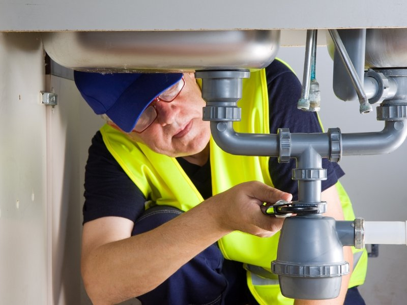

Olá, pessoal do **HotMoney**! Eu sou o Julio Mesquita, e se você está lendo este artigo, é porque tem sede de conhecimento... e talvez de uma nova fonte de renda que não pare de jorrar dinheiro!

Muitas vezes, buscamos oportunidades mirabolantes no digital, mas esquecemos das profissões mais clássicas, aquelas que o mundo _sempre_ vai precisar. E no topo dessa lista de "necessidades eternas" está ele: o **Encanador**.

Esqueça a imagem do profissional que só aparece em desespero. Um encanador moderno e qualificado é um verdadeiro herói, um **resolvedor de problemas**, e o melhor: um profissional com potencial de lucro que você nem imagina.

Neste guia completo, vou te mostrar o potencial financeiro da profissão de **encanador**, o que você precisa para começar a faturar consertando vazamentos e como transformar essa habilidade em um negócio próprio lucrativo. **Preparado(a) para encher o seu bolso?**

**Leia também:** [Marido de Aluguel 2.0: Como Ganhar R$ 3.000 ou Mais por Mês Fazendo Desentupimentos Simples em Casa](https://hotmoney.blog.br/marido-de-aluguel/)

## **Por Que o Encanador é o "Trabalho de Ouro" da Renda Extra?**

No universo da renda extra, a profissão de **encanador** se destaca por uma razão simples e poderosa: **a demanda é urgente, constante e insubstituível.**

Pense bem: um vazamento sério não pode esperar. O cliente precisa de uma solução _agora_. Esse fator "emergência" permite que o serviço seja precificado de forma justa e, muitas vezes, premium.

**O Potencial de Lucro (A Água é Dinheiro!)**

Ao contrário de muitos serviços, que são negociados por um preço fixo e baixo, o trabalho de um bom **encanador** é valorizado pelo conhecimento técnico e, principalmente, pela **resolução rápida do problema**.

**Exemplo HotMoney:** Uma simples troca de reparo de caixa acoplada pode levar 30 minutos, mas o conhecimento para identificar o problema e a agilidade para resolvê-lo valem muito. Enquanto um serviço simples pode render R$ 80-R$ 150, um vazamento mais complexo ou uma emergência noturna pode facilmente ultrapassar R$ 300 por poucas horas de trabalho.

Se você fizer dois ou três serviços extras por semana, já tem uma renda sólida pingando no seu caixa!

## **O Caminho das Águas: O que Você Precisa para se Tornar um Encanador Profissional**

Para ter **Autoridade** e **Confiabilidade** como Encanador (o nosso famoso E-E-A-T!), você precisa de mais do que apenas um alicate. Você precisa de conhecimento.

### **Habilidades Técnicas Essenciais (Aprender a Resolver Problemas)**

A base do seu sucesso está em saber diagnosticar e resolver. Algumas das habilidades que você deve dominar incluem:

-   **Leitura de Plantas:** Entender o desenho hidráulico de uma casa ou apartamento.
-   **Conexões e Materiais:** Saber a diferença entre PVC, CPVC, PPR, e saber qual material usar em cada situação.
-   **Reparos Básicos:** Troca de torneiras, reparos em caixas d’água e descargas.
-   **Desentupimento:** Técnicas e ferramentas corretas para desentupir sem danificar.

### **Formação: É Preciso Fazer um Curso?**

A resposta é **SIM**, e isso te dará a **Especialidade** necessária.

-   **Busque Certificação:** Cursos profissionalizantes em instituições renomadas como o **SENAI** dão uma base técnica excelente. Eles te ensinam as normas técnicas e as práticas seguras.
-   **Cursos Online Rápidos:** Para quem já tem alguma familiaridade, existem ótimos cursos online focados em "Encanador Residencial" ou "Reparos Hidráulicos". São mais baratos e te colocam em campo mais rápido.

**Lembre-se:** O certificado não é só um papel; é a prova da sua **Confiança** para o cliente, o que facilita na hora de cobrar um preço justo.

## **O Kit de Sobrevivência: Ferramentas Essenciais para Começar com Pouco**

A boa notícia é que você não precisa de um caminhão de ferramentas para começar a sua jornada como **encanador**. Para pegar os primeiros serviços de renda extra, foque no essencial:

**Ferramenta Essencial**

**Por Que é Necessária**

**Chave Grifo** (ou Chave de Cano)

Sua principal ferramenta para apertar e soltar conexões.

**Alicates** (Bomba d’Água e de Pressão)

Indispensáveis para segurar peças e manusear canos.

**Trena e Nível**

Para medições precisas e garantir um trabalho reto.

**Fita Veda-Rosca e Cola PVC**

Seus consumíveis básicos para vedar e unir.

**Serra Copo e Arco de Serra**

Para cortar tubos e abrir furos.

**EPIs Básicos** (Óculos e Luvas)

**Segurança em primeiro lugar!** Proteção e profissionalismo.

**Dica HotMoney:** Comece com o básico. Conforme o dinheiro dos serviços for entrando, você reinveste em ferramentas mais caras e especializadas (como máquinas de desentupimento ou detector de vazamentos).

## **De Zero a Herói: Como Cobrar e Aumentar Seu Lucro por Serviço**

Aqui está a parte que mais interessa ao nosso público: **Como fazer o dinheiro do encanamento render!**

### **A Tabela de Preços (Como Formar o Valor)**

Jamais cobre apenas "o valor da hora". Um **encanador** de sucesso cobra pelo **valor da solução** e pelo seu conhecimento técnico.

1.  **Taxa de Visita/Deslocamento:** Cobre um valor fixo apenas para ir até o local, diagnosticar e orçar. Esse valor já cobre seu tempo e gasolina, mesmo que o cliente não feche o serviço.
2.  **Custo do Serviço (Mão de Obra):** É o valor do seu trabalho para resolver o problema. Baseie-se no tempo estimado, complexidade e risco.
3.  **Custo do Material:** O material é cobrado **à parte**, com uma pequena margem de lucro pela sua agilidade em providenciá-lo.

**Estratégia Premium:** Serviços de emergência (após as 18h ou fins de semana) têm um _acréscimo de 30% a 50%_. Essa é a hora em que você lucra mais, porque a demanda é mais urgente!

### **Formalização é Lucro: Vantagens de ser MEI como Encanador**

Para crescer e se tornar um negócio sério, você precisa de **Confiança**. Abrir um **MEI (Microempreendedor Individual)** como Encanador (CNAE 4322-3/01) traz vantagens que aceleram seu lucro:

-   **Credibilidade:** Você pode emitir Nota Fiscal (NF), o que é obrigatório para condomínios e empresas.
-   **Contas Bancárias:** Facilidade para ter uma conta PJ separada da sua pessoal.
-   **Benefícios:** Acesso a aposentadoria, auxílio-doença, etc.

## **Como Encher sua Agenda: Estratégias de Marketing para Encanadores**

Ter **Experiência** e **Especialidade** é ótimo, mas se ninguém souber, você não fatura! Seu foco inicial deve ser no marketing local e na construção de **Autoridade**.

1.  **O Digital:**
    -   **Google Meu Negócio:** Essencial! Crie seu perfil, marque a área de atendimento e peça para **TODOS** os clientes deixarem uma avaliação 5 estrelas. É como você aparece no mapa do Google.
    -   **Grupos de Bairro:** Esteja ativo nos grupos de Facebook e WhatsApp da sua região. As pessoas pedem indicação de **encanador** ali o tempo todo!
2.  **O Clássico:**
    -   **Parcerias Estratégicas:** Deixe seu cartão com administradoras de condomínios, síndicos e zeladores. Eles são a sua principal fonte de indicação.
    -   **O "Antes e Depois":** Peça permissão para tirar uma foto do problema e da solução. Isso funciona como prova social nas suas redes e reforça sua **Experiência**.

## **Conclusão: Deixe a Renda Extra Fluir!**

Viu só? A profissão de **[encanador](https://www.osascenter.com.br/)** é muito mais do que apertar umas roscas. É uma oportunidade de negócio sólido, de alta demanda e que recompensa o conhecimento e a agilidade.

Se você está buscando uma **renda extra** que pode facilmente se tornar sua principal fonte de sustento, ou mesmo um negócio escalável, comece hoje a investir na sua formação técnica e no seu kit de ferramentas. O dinheiro está esperando o seu cano ser consertado!

**E aí, qual o primeiro curso que você vai pesquisar para começar a sua jornada como encanador empreendedor?** _Deixe seu comentário e vamos juntos planejar o seu sucesso!_
