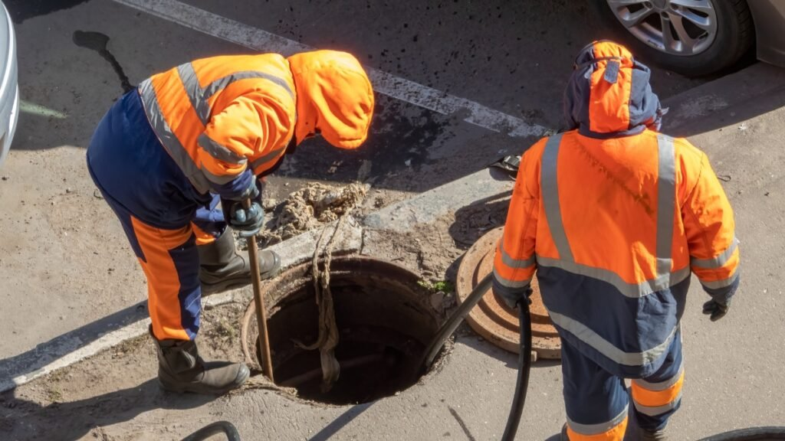

Você já imaginou viver tranquilamente com um salário fixo, enquanto cuida da saúde do esgoto das empresas? Isso mesmo! A manutenção preventiva de esgoto não é apenas uma necessidade; é uma oportunidade de negócio que pode garantir sua renda recorrente.
Neste artigo, vamos explorar como você pode transformar contratos de manutenção em uma fonte estável de receita. Afinal, quem disse que trabalhar com algo tão essencial não pode ser lucrativo e satisfatório? Prepare-se para descobrir o caminho para uma carreira próspera nesse segmento!

## A Mudança de Chave: Por Que a Renda Recorrente Funciona

A renda recorrente é como um carro automático: você acelera e ele vai! Ao invés de viver na montanha-russa das emergências, com contratos que surgem do nada, a manutenção preventiva traz previsibilidade. Isso significa menos estresse e mais segurança financeira.
Além disso, quando os clientes veem valor no seu serviço mensal, eles tendem a permanecer fiéis. E quem não gosta de ter uma fonte estável de receita? Essa mudança de chave pode transformar sua vida profissional em algo muito mais gratificante e lucrativo.

**Leia também:** [Marido de Aluguel 2.0: Como Ganhar R$ 3.000 ou Mais por Mês Fazendo Desentupimentos Simples em Casa](https://hotmoney.blog.br/marido-de-aluguel/)

### O Ciclo Vicioso da Emergência

A rotina de muitos profissionais de manutenção é marcada por um ciclo vicioso. Quando a emergência bate à porta, a pressão aumenta e o tempo parece escasso. O telefone toca incessantemente com pedidos imediatos, enquanto as soluções temporárias se acumulam.
Esse cenário gera estresse e insatisfação. Em vez de prevenir problemas, a maioria acaba apagando incêndios. A ironia? Quanto mais urgente é a situação, menos chance têm os profissionais de pensar em estratégias que garantiriam estabilidade financeira e clientes fiéis no futuro.

### O Poder da Previsibilidade

Quando falamos em manutenção preventiva de esgoto, a previsibilidade se torna um verdadeiro superpoder. Saber que você pode contar com uma receita fixa todo mês traz tranquilidade e segurança. Ao invés de correr atrás do prejuízo, você antecipa problemas antes que eles se tornem emergências.
Imagine ter clientes que confiam no seu trabalho e estão dispostos a pagar por isso! Com contratos recorrentes, você cria um fluxo constante de renda, permitindo investir mais tempo em estratégias para crescer ainda mais. É como plantar sementes para uma colheita abundante!

### Diferencial de Mercado

No mundo da manutenção preventiva de esgoto, destacar-se é crucial. A concorrência é intensa, e ter um diferencial pode ser o que você precisa para conquistar clientes fiéis. Oferecer serviços personalizados ou pacotes exclusivos pode atrair a atenção dos proprietários. Se você é uma [Desentupidora em Fazenda Rio Grande](https://desentupidoradecuritiba.eco.br/), no estado do Paraná, por exemplo, a especialização em contratos recorrentes nessa região pode ser o seu grande atrativo.

Além disso, a transparência nos processos e na comunicação gera confiança. Quando os clientes percebem um serviço diferenciado e atencioso, eles não hesitam em fechar contratos recorrentes. Afinal, quem não quer contar com uma empresa que realmente se importa?

## Identificando o Cliente Ideal para Contratos

Identificar o cliente ideal é como encontrar um tesouro escondido. Restaurantes e lanchonetes, por exemplo, têm uma grande demanda por manutenção preventiva de esgoto. Imagine a dor de cabeça deles com entupimentos inesperados! Oferecer soluções antes que problemas aconteçam é um serviço valioso.
Condomínios residenciais e comerciais também são ótimos alvos. Com muitas unidades habitacionais, eles precisam garantir que tudo funcione bem para os moradores. Pequenas indústrias ou comércios com cozinhas não ficam atrás; todos querem evitar surpresas desagradáveis que afetam seus negócios.

### Restaurantes/Lanchonetes

Restaurantes e lanchonetes são verdadeiros núcleos de movimento. Cada garfada, cada lanche, merece um esgoto funcionando perfeitamente. Imagine o caos se algo der errado! A manutenção preventiva é a salvação para evitar surpresas desagradáveis durante aquele horário de pico.
Além disso, clientes felizes são os que retornam sempre. Manter tudo limpo e funcionando bem não só evita problemas, mas também traz confiança ao consumidor. E quem não quer ser lembrado como o lugar onde tudo flui bem? É hora de fazer esses estabelecimentos prosperarem com contratos recorrentes!

### Condomínios Residenciais/Comerciais

Os condomínios residenciais e comerciais são verdadeiros tesouros para quem busca contratos de manutenção preventiva de esgoto. Com a quantidade constante de moradores ou funcionários, o sistema precisa estar sempre em péssimas condições. É aí que você entra!
Imagine oferecer um serviço que garanta a tranquilidade dos síndicos e proprietários. Eles vão valorizar muito mais a prevenção do que remediar problemas emergenciais. Além disso, um contrato fixo com esses clientes significa uma renda garantida todo mês!

### Pequenas Indústrias/Comércio com Cozinha

As pequenas indústrias e comércios com cozinha são verdadeiros tesouros para quem quer viver de contratos de manutenção preventiva de esgoto. Esses estabelecimentos, que vão desde padarias até fábricas de alimentos, enfrentam desafios diários relacionados ao mau funcionamento do sistema de esgoto. Um imprevisto pode paralisar a produção e gerar prejuízos.
Oferecer um pacote regular de manutenção é uma solução inteligente. Assim, você garante não só a saúde do sistema, mas também a tranquilidade dos proprietários em manter seus negócios sempre prontos para atender à demanda.

## Montando e Precificando o Seu Pacote de Serviços

Criar um pacote de serviços atraente é como montar um prato delicioso. Você precisa dos ingredientes certos, que neste caso são itens essenciais, como inspeções regulares e limpeza de fossas. Pense também em oferecer bônus, como relatórios mensais sobre a saúde do sistema de esgoto. Isso encanta o cliente!
Agora, a precificação deve ser estratégica. Considere os custos operacionais e adicione uma margem que reflita seu valor no mercado. Um preço justo atrai clientes fiéis e mantém suas finanças saudáveis!

### Itens Essenciais do Contrato

Quando se trata de contratos de manutenção preventiva de esgoto, alguns itens são fundamentais. Primeiro, inclua a frequência das manutenções. Isso garante que o cliente saiba exatamente quando e como você estará presente para cuidar do sistema.
Além disso, é crucial definir as responsabilidades de ambas as partes. Deixe claro o que está coberto pelo contrato e quais ações exigem custos adicionais. Dessa forma, evita-se qualquer mal-entendido no futuro e todos saem ganhando com um acordo transparente!

### A Fórmula da Precificação Inteligente

Quando se trata de precificação inteligente, o segredo está em entender seu cliente e os custos envolvidos. Calcule suas despesas fixas e variáveis com precisão. Adicione uma margem que garanta lucro, mas sem exageros. O equilíbrio é a chave.
Outra dica valiosa é analisar o mercado. Pesquise concorrentes e ajuste seus preços para se destacar, oferecendo pacotes que façam sentido para os clientes. Lembre-se: um preço bem definido pode conquistar a confiança do cliente antes mesmo da primeira visita técnica!

## O Pitch de Vendas: Fechando Contratos Recorrentes

Chegou a hora de brilhar! O pitch de vendas é sua chance de conquistar o cliente com uma conversa leve e envolvente. Comece focando na prevenção das perdas, mostrando como um contrato de manutenção preventiva pode evitar problemas futuros. A segurança traz conforto, e quem não quer isso?
Depois, apresente sua proposta de valor. Destaque os benefícios da fidelidade: descontos, atendimento prioritário e tranquilidade garantida. Afinal, quem se sente bem atendido está mais propenso a fechar negócio logo ali mesmo!

### O Roteiro da Conversa

Quando você se senta para a conversa, é hora de brilhar. Comece apresentando-se e estabelecendo uma conexão genuína. Pergunte sobre os desafios que o cliente enfrenta com o esgoto e ouça atentamente. Esse é o seu momento de descobrir as dores.
Depois, entre no cerne da questão: a prevenção! Explique como seus serviços podem evitar problemas maiores e mais caros no futuro. Mostre dados e exemplos práticos. A energia positiva na conversa vai ajudar a construir confiança, essencial para fechar aquele contrato desejado!

#### Passo 1: Focar na Prevenção de Perdas

Quando falamos em manutenção preventiva de esgoto, a primeira coisa que vem à mente é evitar problemas. Imagine um restaurante enfrentando uma entupimento durante o horário de pico! É aí que você entra, como o herói da água limpa.
Ao mostrar ao cliente os custos altos de emergências e paradas inesperadas, você destaca a importância da prevenção. Quanto menos eles lidam com crises, mais dinheiro sobra para investir em outras áreas do negócio. Essa abordagem não só conquista clientes, mas também ajuda a construir relacionamentos duradouros.

#### Passo 2: Apresentar a Proposta de Valor

Apresentar a proposta de valor é onde a mágica acontece. Aqui, você deve mostrar ao cliente como seus serviços são essenciais para evitar dores de cabeça futuras. Destaque os benefícios da manutenção preventiva e mostre que investir agora pode poupar dinheiro depois.
Use exemplos práticos que o cliente possa relacionar com seu dia a dia. Fale sobre como um esgoto limpo resulta em menos problemas e mais tranquilidade. Seja claro e objetivo, fazendo com que eles vejam sua oferta não apenas como um custo, mas sim como uma proteção valiosa!

#### Passo 3: A Vantagem da Fidelidade

Fidelizar clientes no ramo de manutenção preventiva de esgoto é um verdadeiro trunfo. Quando você estabelece um relacionamento sólido, transforma uma simples prestação de serviços em uma parceria duradoura. Os clientes fiéis não apenas garantem receitas recorrentes, mas também se tornam promotores do seu trabalho, recomendando seus serviços para amigos e familiares.
Além disso, a confiança conquistada facilita negociações futuras e aumenta a disposição deles em investir em pacotes mais abrangentes. Essa vantagem competitiva faz toda a diferença na busca por estabilidade financeira nesse setor!

### Documentação Simples

Ao fechar contratos de manutenção preventiva de esgoto, a documentação é um passo crucial. Mas não se preocupe! Não precisa ser um labirinto burocrático. Um contrato simples e claro pode resolver 90% das dores de cabeça.
Inclua informações básicas como serviços prestados, prazos e valores. Use uma linguagem acessível para que o cliente entenda tudo sem complicações. Lembre-se: quanto mais direto, melhor! Assim, você constrói confiança e facilita o relacionamento com seus clientes.

## Conclusão

Viver de contratos de manutenção preventiva de esgoto é uma oportunidade incrível para garantir um fluxo financeiro constante. Ao adotar essa abordagem, você não só evita o ciclo vicioso das emergências, mas também se destaca no mercado com serviços previsíveis e confiáveis.
Identificar seu cliente ideal é fundamental; restaurantes, condomínios e pequenas indústrias são excelentes alvos. Montar pacotes bem estruturados, aliados a uma precificação inteligente, vai facilitar o fechamento dos contratos.
E lembre-se: sua capacidade de vender esse serviço com segurança fará toda a diferença! Portanto, prepare-se para colher os frutos dessa estratégia e transforme sua paixão por manutenção em uma fonte sólida de renda. Vamos juntos nessa jornada?
