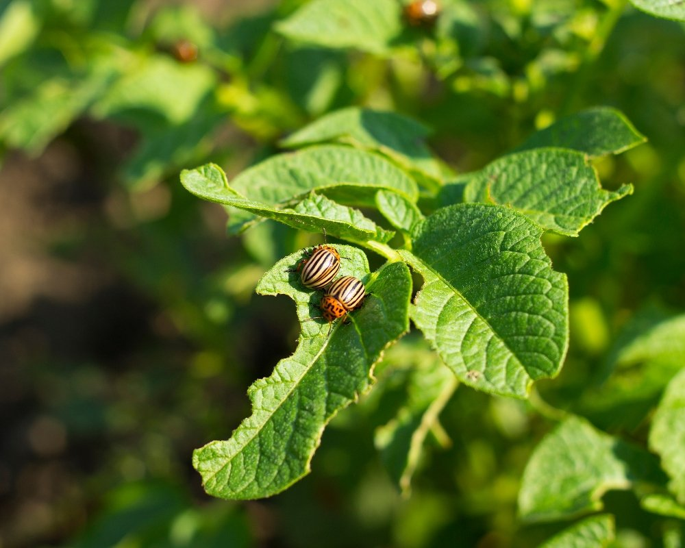

Se você já deu um pulo de susto ao acender a luz da cozinha de madrugada e ver uma barata "maratonista", ou se já perdeu um móvel caro para os cupins, você sabe: pragas urbanas não são apenas nojentas, elas custam caro.

Aqui no **Hotmoney**, a nossa missão é fazer o seu dinheiro render. E sabe qual é uma das formas mais inteligentes de cuidar do seu bolso? Evitar prejuízos desnecessários e, quem sabe, enxergar uma oportunidade de negócio onde a maioria só vê problema.

Neste guia, vou te mostrar como o **controle de pragas** pode deixar de ser uma dor de cabeça para se tornar um aliado da sua saúde financeira.

**Leia também:** [Como montar um serviço de desentupimento básico e faturar R$ 3.000 extras por mês](https://hotmoney.blog.br/como-montar-um-servico-de-desentupimento/)

## **O que é, afinal, o Controle de Pragas?**

Muita gente acha que controlar pragas é só sair espalhando veneno por aí. Errado! O termo técnico é **Manejo Integrado de Pragas (MIP)**.

Diferente da dedetização comum, que é uma ação corretiva (o bicho apareceu, você mata), o controle de pragas é um conjunto de medidas preventivas. É sobre impedir que o "inimigo" entre, se alimente e se reproduza na sua casa ou comércio.

### **Por que você deve se importar com isso?**

1.  **Saúde:** Pragas transmitem doenças que podem gerar gastos médicos altíssimos.
2.  **Patrimônio:** Cupins podem destruir o telhado da sua casa; ratos podem roer fiações e causar incêndios.
3.  **Economia:** Prevenir com métodos caseiros e inteligentes é 10x mais barato do que contratar uma emergência química.

## **Controle de Pragas vs. Dedetização: Qual a diferença?**

**Característica**

**Dedetização Tradicional**

**Controle de Pragas (MIP)**

**Foco**

Matar os insetos visíveis

Prevenir a infestação

**Frequência**

Quando há surto

Constante e planejado

**Custo**

Geralmente mais alto por aplicação

Investimento baixo e recorrente

**Segurança**

Uso intenso de químicos

Foco em barreiras físicas e higiene

## **Dicas "Hotmoney" para fazer o seu próprio controle preventivo**

Antes de gastar fortunas com empresas, você pode aplicar a regra dos **4 As**:

-   **Acesso:** Vede frestas em portas e janelas. Use telas nos ralos.
-   **Abrigo:** Não acumule entulho, caixas de papelão ou madeira úmida.
-   **Alimento:** Lixo sempre fechado e nada de louça suja no pernoite.
-   **Água:** Verifique vazamentos. Praga ama umidade.

## **A Oportunidade: Transformando Pragas em Renda Extra**

Aqui é onde o jogo fica interessante para quem busca liberdade financeira. O setor de controle de pragas e higienização cresce em média **10% ao ano** no Brasil. Com a conscientização pós-pandemia, empresas e condomínios estão investindo pesado nisso.

**Como começar a olhar para isso como negócio?**

1.  **Especialização:** Você não precisa começar sendo uma multinacional. Existem cursos técnicos acessíveis de **Sanitização de Ambientes** ou **Controle de Formigas e Baratas**.
2.  **Baixo Investimento Inicial:** Com um pulverizador de qualidade, EPIs (Equipamentos de Proteção Individual) e os produtos certos (autorizados pela ANVISA), você já consegue atender pequenos escritórios e residências.
3.  **Recorrência:** O melhor desse negócio é que ele não é feito uma vez só. O controle precisa ser renovado a cada 3 ou 6 meses. Isso gera **previsibilidade de caixa** para o seu bolso.

**Nota do Julio:** Se você é detalhista e não tem medo de "trabalho sujo", esse mercado é pouco explorado por profissionais autônomos qualificados. É uma excelente forma de escalar seus ganhos.

## **Conclusão: De Praga a Patrimônio**

O [controle de pragas](https://biosolucoes.app.br/) é sobre proteção. Proteção da sua família, da sua casa e, claro, do seu suado dinheirinho. Seja aplicando métodos preventivos para não ter gastos inesperados, ou estudando o setor para oferecer serviços, o importante é não ignorar esse tema.

E aí, você já teve algum prejuízo grande com pragas ou já pensou em trabalhar nessa área? Conta pra mim nos comentários!
