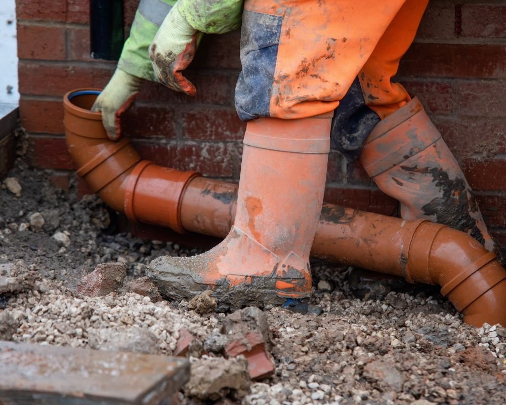

Se você acompanha o [**hotmoney.blog.br**](http://hotmoney.blog.br), sabe que eu sou fã de oportunidades que estão "escondidas" onde pouca gente quer olhar. E vamos ser sinceros: ninguém acorda pensando em tubulações de fábricas... até que algo pare.

O **desentupimento industrial** não é apenas "passar uma sondinha". Estamos falando de uma operação logística pesada, tecnologia de ponta e, principalmente, um mercado que paga muito bem pela especialização.

Seja você um gestor querendo evitar prejuízos na sua planta ou alguém de olho em um novo nicho de serviço lucrativo, este guia foi feito para você. Vamos descomplicar?

**Leia também:** [Controle de Pragas: Guia Prático para Economizar e até Ganhar Dinheiro com Isso!](https://hotmoney.blog.br/controle-de-pragas)

## **Por que o Desentupimento Industrial é "Outro Nível"?**

No ambiente doméstico, um entupimento é chato. No ambiente industrial, um entupimento é **prejuízo bruto**. Uma linha de produção parada por causa de refluxo de resíduos pode custar milhares de reais por hora.

Diferente da sua casa, as indústrias lidam com:

-   **Resíduos Químicos:** Que podem corroer tubulações comuns.
    
-   **Escala Gigante:** Tubulações de diâmetros enormes que exigem pressão absurda.
    
-   **Regulamentação Rigorosa:** Você não pode simplesmente jogar o que saiu do cano no esgoto comum. Existe um descarte ecológico obrigatório.
    

## **As Tecnologias que Comandam o Mercado**

Para resolver problemas desse tamanho, não se usa ferramentas de amador. Se você está pensando em investir ou contratar, precisa conhecer estas duas palavras:

### **1\. Hidrojateamento de Alta Pressão**

É o "rei" do setor. Utiliza-se jatos de água com pressão que pode chegar a 40.000 PSI (para você ter ideia, um pneu de carro tem 32 PSI). Esse jato corta raízes, remove incrustações de minério e limpa as paredes do cano como se fossem novas.

### **2\. Caminhão Combinado (Vácuo e Jato)**

Esse é o "tanque de guerra" do desentupimento. Ele tem um sistema que joga água sob pressão e outro que suga os detritos simultaneamente. Para quem quer empreender, esse equipamento é o maior investimento, mas também o que traz os contratos mais gordos com prefeituras e indústrias.

## **Segurança e Normas: Onde o Profissional se Diferencia**

Aqui no blog, eu sempre falo sobre **credibilidade**. No desentupimento industrial, isso se traduz em normas técnicas. Se você vai prestar o serviço ou contratar, exija:

-   **NR-33 (Espaço Confinado):** Essencial para quem trabalha em tanques e galerias.
    
-   **NR-35 (Trabalho em Altura):** Muitas tubulações industriais são aéreas.
    
-   **Licença da CETESB/IBAMA:** O transporte de resíduos industriais exige rastreabilidade. Sem isso, a multa pode quebrar o seu negócio.
    

**Dica do Hotmoney:** Se você quer entrar nesse ramo, comece tirando as certificações. Elas são o seu "cartão de visitas" para fechar contratos com grandes empresas que não contratam amadores.

## **Manutenção Preventiva: O Segredo do Lucro Constante**

Se você busca uma forma de gerar renda recorrente, o segredo não é esperar o cano estourar. É vender o **contrato de manutenção**.

Para a indústria, é muito mais barato pagar uma mensalidade para limpeza periódica do que parar a fábrica por 3 dias em uma emergência. Para o prestador de serviço, isso significa **dinheiro previsível no bolso todo mês**.

## **Como Começar a Lucrar nesse Ramo?**

Se você, assim como eu, vê uma oportunidade de negócio em cada problema, aqui estão os passos para transformar o [desentupimento industrial](https://desentupidora.emp.br/) em renda:

1.  **Capacitação Técnica:** Não tente aprender na base do "tentativa e erro". Faça cursos de operação de hidrojato.
    
2.  **Equipamento de Entrada:** Você não precisa começar com um caminhão de 1 milhão de reais. Existem máquinas de hidrojateamento portáteis de alta performance para serviços menores.
    
3.  **Foco em Nichos:** Comece oferecendo limpeza de caixas de gordura para restaurantes industriais ou condomínios logísticos. É um degrau abaixo da "pesada", mas com muita demanda.
    

### **Conclusão**

O desentupimento industrial é a prova de que **onde há um problema complexo, há uma oportunidade financeira**. É um setor que exige seriedade, EPIs e respeito ao meio ambiente, mas que oferece margens de lucro que o serviço doméstico raramente alcança.

E aí, você já tinha parado para pensar no potencial desse mercado "invisível"?
