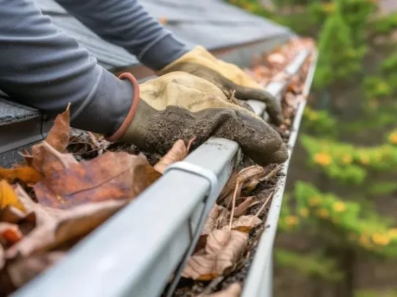

Você já acordou com aquele barulho de "cachoeira" batendo no telhado, apenas para descobrir que a sua calha virou um jardim suspenso de tanta folha e terra? Pois é, a **limpeza de calha** é uma daquelas tarefas que a gente costuma ignorar até que o problema (e o prejuízo) bata à nossa porta.

Aqui no **Hotmoney**, eu, Julio Mesquita, sempre bato na tecla: conhecimento é dinheiro. Seja para você economizar fazendo sozinho ou para aprender uma nova habilidade e oferecer como serviço, entender o "pulo do gato" da manutenção residencial é essencial.

Neste guia, vou te mostrar como fazer esse serviço de forma profissional, segura e, claro, como isso pode colocar uma grana extra no seu bolso.

**Leia também:** [Hidrojateamento: Como Abrir Seu Negócio Altamente Lucrativo e de Baixo Investimento](https://hotmoney.blog.br/hidrojateamento/)

## **Por que a limpeza de calha é tão importante?**

Antes de colocar a mão na massa (ou na lama), entenda o valor disso. Uma calha entupida causa:

-   **Infiltrações:** A água transborda e vai direto para o forro e paredes.
-   **Danos estruturais:** O peso da água parada pode empenar ou soltar os suportes.
-   **Foco de doenças:** Água parada é o paraíso para o mosquito da dengue.

**Dica do Julio:** Quando você explica isso para um vizinho ou cliente, você deixa de ser "alguém limpando calha" e vira um "especialista em prevenção". Isso agrega valor!

## **Checklist: O que você precisa para começar**

Para um trabalho bem feito, não precisa de máquinas caríssimas. O básico bem feito resolve:

1.  **Escada extensível** (com pés antiderrapantes).
2.  **Luvas de borracha resistentes** (proteção contra cortes e sujeira).
3.  **Pequena pá de jardim** ou uma espátula.
4.  **Balde e ganchos** (para não precisar descer a escada toda hora).
5.  **Mangueira com boa pressão.**

## **Passo a Passo: Como limpar calhas como um profissional**

### **1\. Segurança em primeiro lugar**

Nunca suba no telhado se ele estiver molhado. Posicione a escada em solo firme. Se possível, peça para alguém segurar a base para você. **Segurança não é gasto de tempo, é investimento.**

### **2\. Remoção de detritos brutos**

Comece perto dos bocais (os canos de descida). Use a pazinha para remover folhas, galhos e lodo. Coloque tudo no balde. Evite empurrar a sujeira para dentro do cano de descida, ou você terá um problema muito maior para desentupir depois.

### **3\. Lavagem e teste de fluxo**

Com a parte grossa removida, use a mangueira para lavar a calha. Direcione o jato no sentido oposto ao bocal primeiro, e depois lave em direção a ele. Observe se a água desce livremente. Se formar poça, a calha pode estar com o caimento errado.

## **Como transformar a Limpeza de Calha em Renda Extra?**

É aqui que o **Hotmoney** entra de verdade! Muitas pessoas têm pavor de altura ou simplesmente não têm tempo.

-   **Quanto cobrar:** Um serviço simples em casas térreas pode variar entre **R$ 150,00 a R$ 400,00**, dependendo da metragem.
-   **O Combo da Renda Extra:** Ofereça a [limpeza de calhas](https://www.universoambiental.eco.br/) junto com a limpeza de caixas d'água ou poda de galhos próximos ao telhado.
-   **Oportunidade:** Após grandes tempestades ou no final do outono, a demanda explode. É a hora de anunciar nos grupos do WhatsApp do bairro.

**Insight do Julio:** Eu já vi gente começando com uma escada emprestada e, em dois meses, comprando equipamentos profissionais apenas com o lucro das limpezas de fim de semana.

## **Dicas de Especialista para não errar**

-   **Verifique os suportes:** Enquanto limpa, veja se os pregos ou parafusos da calha estão firmes. Se estiverem soltos, aperte-os. Isso mostra profissionalismo extremo.
-   **Use telas protetoras:** Sugira ao cliente (ou instale na sua casa) telas de proteção. Elas evitam que folhas grandes entrem, facilitando a próxima limpeza.
-   **Fotos de "Antes e Depois":** Isso é a sua melhor propaganda. Mostre ao cliente como estava e como ficou. A confiança que isso gera é o que faz ele te indicar para o condomínio inteiro.

## **Conclusão**

Limpar a calha pode não ser o trabalho mais glamouroso do mundo, mas é prático, necessário e extremamente lucrativo se você souber vender o serviço. Seja para cuidar do seu patrimônio ou para iniciar uma jornada de **liberdade financeira** com serviços manuais, o segredo é começar.

E aí, pronto para subir o primeiro degrau? Se você gostou dessas dicas e quer mais ideias de como ganhar dinheiro com serviços que todo mundo precisa, explore outros artigos aqui no **hotmoney.blog.br**!

**Gostou desse guia?** Me conta aqui nos comentários: você já tentou limpar sua própria calha ou já pensou em oferecer esse serviço na sua região? Vamos trocar uma ideia!
