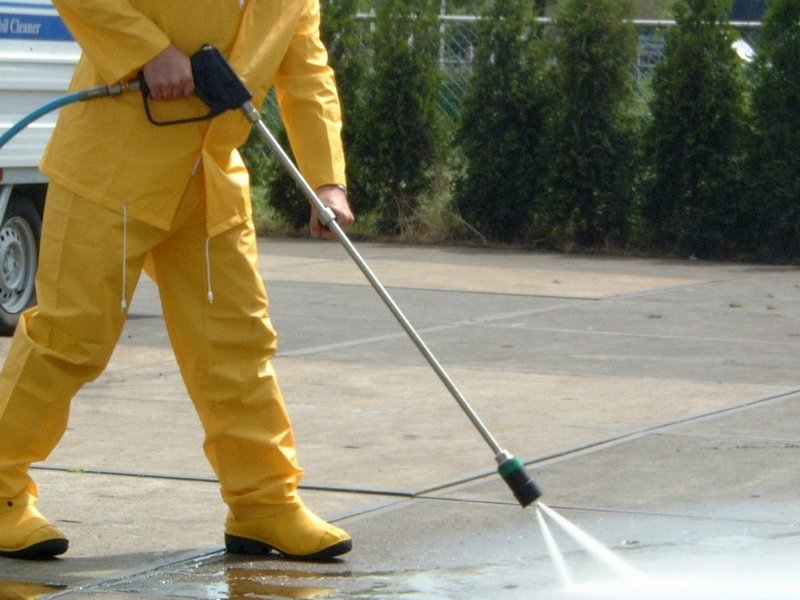

Olá! Meu nome é Julio Mesquita, e se você chegou até aqui, é porque, assim como eu, está na busca incessante por aquela **ideia de renda extra que realmente vale a pena**, que te tira da mesmice e te coloca no caminho da liberdade financeira.

E é por isso que, hoje, vamos falar sobre um nicho que pouca gente na nossa área de _hotmoney_ se lembra: o **Hidrojateamento**.

Eu sei, parece muito técnico! Mas relaxa. Por trás desse nome complexo está uma **oportunidade de negócio de alta demanda, alta margem de lucro e que pode ser iniciada com um investimento surpreendentemente baixo**.

Vou te mostrar o passo a passo para transformar essa ideia em um CNPJ lucrativo. Se você está pronto para sair do óbvio e montar um negócio com potencial de **fazer seu dinheiro render de verdade**, vem comigo!

## **Afinal, o que é Hidrojateamento e Por Que Ele é um Negócio Quente (****_Hot Money_****)?**

Se você está pensando em abrir uma empresa de serviços, o hidrojateamento é um serviço essencial que está sempre em alta.

Em termos simples, **hidrojateamento** é o processo de utilizar um jato d'água de altíssima pressão para limpar, desentupir, desincrustar ou remover materiais.

É muito mais do que a lavadora de alta pressão que você tem em casa! Estamos falando de máquinas profissionais, capazes de gerar pressões que variam de 100 até mais de 1.000 bar.

**Leia também:** [Encanador: Como Transformar Vazamentos em Uma Fonte de Renda Extra Sólida e Altamente Lucrativa!](https://hotmoney.blog.br/como-transformar-vazamentos-em-uma-fonte-de-renda/)

### **Por que o Hidrojateamento é um Serviço de Alta Demanda?**

Aqui é onde o seu **dinheiro extra** começa a aparecer:

-   **Desentupimento Profissional:** Não é só para ralo de pia. É para redes de esgoto, galerias pluviais e tubulações industriais, onde o entupimento é grave e o desentupedor comum falha.
-   **Limpeza Pesada:** Remoção de sujeira incrustada, musgos, limo em fachadas de prédios, pisos de concreto, rodovias e pátios industriais.
-   **Remoção de Materiais:** Ideal para remover tinta velha, ferrugem, ou até mesmo preparo de superfícies para pintura nova.
-   **Segmento Industrial:** Indústrias precisam manter seus equipamentos e tubulações limpos, o que garante contratos recorrentes para quem é especialista.

**A Sacada Hotmoney:** Em vez de focar no consumidor final, que busca o mais barato, **mire em condomínios, empresas e indústrias**. Eles precisam de nota fiscal, serviço de qualidade e agendamentos periódicos, o que garante a sua **receita recorrente**.

## **\[Passo 1\] O Básico: Quanto Custa para Começar e o Que Você Precisa?**

A grande notícia é que você **não precisa começar com a máquina mais potente e cara do mercado**. Como em qualquer negócio, o foco é na **validação e no retorno sobre o investimento (ROI)**.

Seu **investimento inicial** será focado em três pilares: **Equipamento, Segurança e Conhecimento**.

### **Equipamentos Essenciais: A Máquina, os Bicos e os EPIs**

Para começar a atender serviços de desentupimento e limpeza residencial/comercial leve, você pode focar em uma **Lavadora de Alta Pressão Profissional ou um Mini-Hidrojato** (entre 100 e 300 bar).

-   **Máquina:** Uma máquina semi-profissional/profissional de boa qualidade pode variar bastante, mas espere investir entre **R$ 5.000 e R$ 15.000** (usada pode ser uma ótima opção inicial!).
-   **Acessórios (Os Hot Bicos):** Você precisará de diferentes bicos de hidrojato, cada um para uma função (desobstrução, limpeza). É um custo menor, mas vital para a qualidade do serviço.
-   **EPIs (Equipamentos de Proteção Individual):** **Jamais economize nisso!** Você está lidando com alta pressão, e a segurança é a sua maior autoridade e confiabilidade (E-E-A-T). Botas, luvas, óculos de segurança e protetores auriculares são inegociáveis.

### **Treinamento e Segurança: O Seu Diferencial de Autoridade**

Ninguém quer contratar o "curioso" da máquina de pressão. O seu **diferencial de mercado** será o seu conhecimento.

Procure por **cursos de operação e segurança em hidrojateamento**. Eles são relativamente curtos e te dão a autoridade e a experiência necessárias para cobrar um valor justo. Além disso, ter um certificado te ajuda a fechar contratos maiores com empresas.

## **\[Passo 2\] Formalização e Burocracia: Abrindo o seu CNPJ (MEI)**

Para o seu negócio ter a cara do **hotmoney.blog.br** (transparência e profissionalismo), a formalização é essencial. Você precisa emitir nota fiscal!

### **Dá para Abrir como MEI? Dicas de Classificação (CNAE)**

Sim, você pode começar como **Microempreendedor Individual (MEI)**!

A classificação ideal (CNAE) que engloba esse tipo de serviço é geralmente relacionada a **serviços de limpeza e desentupimento**.

-   **CNAE Comum:** **8129-0/00 - Atividades de Limpeza não Especificadas Anteriormente.** (Verifique sempre a legislação municipal, pois pode variar).

O MEI te permite ter um CNPJ de forma rápida, barata (apenas o imposto mensal DAS) e ter acesso a benefícios previdenciários. É o caminho mais fácil para quem está começando a testar o mercado.

## **\[Passo 3\] Quanto Cobrar para Lucrar de Verdade (****_HotMoney_** **na Prática)**

Este é o momento mais importante! O que faz o hidrojateamento ser um _hotmoney_ é a sua **alta margem de lucro**. Depois de pagar a depreciação da máquina, seu principal custo é o seu tempo.

### **Precificação: Como Calcular o Valor da Hora/Serviço**

Muitos profissionais erram ao apenas chutar um preço. Faça o seu cálculo com base em:

1.  **Custo Operacional Fixo:** DAS (MEI), internet, telefone.
2.  **Custo da Máquina (Depreciação):** Divida o custo da máquina pela vida útil esperada e adicione um valor por hora para cobrir a troca futura.
3.  **Custo Variável:** Gasolina/Deslocamento, Água (se não for fornecida pelo cliente).
4.  **Seu Salário (o Lucro!):** Quanto você quer ganhar por hora trabalhada.

**Dica de Ouro:** Não cobre apenas pelo tempo. **Cobre pelo Resultado e pela Autoridade**. Um desentupimento complexo em um condomínio pode ser cobrado por **projeto (Job Fee)** e não por hora, garantindo um ticket médio muito mais alto (facilmente acima de R$ 500 para um serviço de 2-3 horas).

### **Onde Encontrar os Primeiros Clientes (Estratégias de Divulgação)**

1.  **Parcerias Estratégicas:** Converse com administradoras de condomínios, síndicos e imobiliárias. Eles têm problemas de entupimento e limpeza pesada _o tempo todo_.
2.  **Google Meu Negócio:** Crie um perfil. As pessoas pesquisam "[Hidrojateamento perto de mim](https://desentupidoraemjundiai.com.br/d/desentupidora-em-jundiai/)" e você precisa estar lá.
3.  **Marketing de Conteúdo:** Use o Instagram ou um mini-blog para mostrar o **"antes e depois"** chocante dos seus serviços. Isso gera **confiança e autoridade**.

## **O Próximo Passo para Sua Liberdade Financeira Começa Agora!**

Viu só? O hidrojateamento, que parecia um bicho de sete cabeças, é na verdade um **nicho sólido e com alto potencial de retorno**.

A liberdade financeira que eu e o **hotmoney.blog.br** buscamos não é um passe de mágica, mas a soma de ideias validadas, como esta, com execução e profissionalismo (E-E-A-T!).

O primeiro passo é sempre o mais difícil. Que tal começar a pesquisar o preço de uma máquina profissional usada e fazer um curso de segurança?
