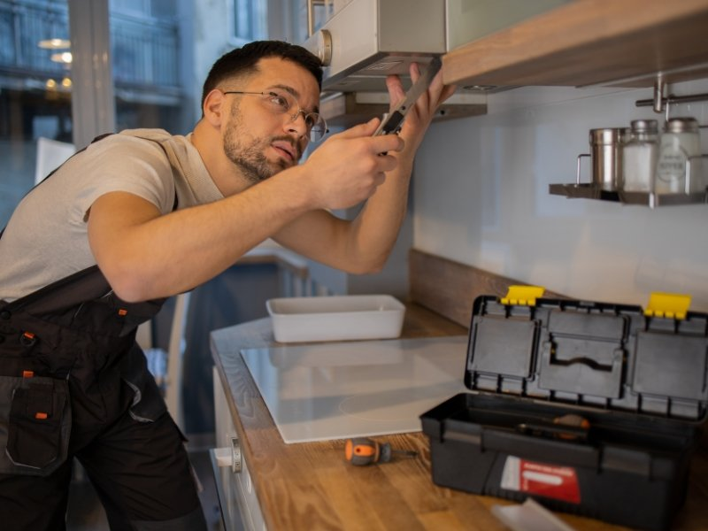

Você já pensou em como um simples trabalho de desentupimento pode transformar sua vida financeira? Imagine ganhar R$ 3.000 ou mais por mês com serviços que qualquer pessoa pode aprender a fazer! O mercado de maridos de aluguel está aquecido e cheio de oportunidades para quem deseja empreender.

Neste artigo, vamos explorar tudo sobre o universo dos maridos de aluguel, desde preços e orçamentos até dicas valiosas para maximizar seus ganhos. Prepare-se para descobrir como essa profissão versátil pode ser a chave para a sua independência financeira!

## Preços e Orçamentos para Serviços de Marido de Aluguel

Quando se fala em marido de aluguel, o primeiro pensamento que vem à mente é: quanto vou gastar? Os preços podem variar bastante dependendo da região e do tipo de serviço solicitado. Em geral, uma consulta pode sair entre R$ 50 a R$ 150, enquanto serviços mais complexos podem atingir até R$ 500.
Por isso, sempre vale a pena pedir orçamentos para comparar. Além disso, negociar pode ser um bom truque! Afinal, todo mundo gosta de um descontinho. E quem sabe você não acaba fazendo amizade com seu "marido"?

**Leia também:** [10 Formas de Fazer Renda Extra Usando o ChatGPT (e Outras IAs) em 2025](https://hotmoney.blog.br/fazer-renda-extra-usando-o-chatgpt/)

### Quanto Custa para Contratar um Marido de Aluguel

Contratar um marido de aluguel pode ser mais acessível do que você imagina. Os preços variam bastante, mas em média, o valor da hora costuma girar em torno de R$ 50 a R$ 100. Isso depende muito da complexidade do serviço e da experiência do profissional.
Por exemplo, serviços simples como troca de lâmpadas são mais baratos, enquanto desentupimentos ou montagens podem custar um pouco mais caro. Vale sempre fazer uma pesquisa para encontrar o melhor custo-benefício na sua região!

## Serviços Prestados por um Marido de Aluguel

Um marido de aluguel é a solução perfeita para pequenas pendências em casa. Desde a instalação de ventiladores de teto que refrescam os dias quentes até pequenos reparos que fazem toda a diferença, esses profissionais estão prontos para ajudar.
Troca de lâmpadas queimadas, instalação de fechaduras e torneiras também entram na lista dos serviços oferecidos. Com um toque especial, eles transformam o lar sem grandes dores de cabeça! A praticidade está ao seu alcance com um simples telefonema.

### Instalação de Ventilador de Teto

Instalar um ventilador de teto pode parecer uma missão complicada, mas com a ajuda de um marido de aluguel experiente, tudo fica mais fácil. Imagine a brisa suave enquanto você relaxa no sofá após um longo dia!
Além disso, o ventilador não só traz conforto térmico, como também dá aquele toque especial à decoração. Escolha o modelo certo e veja sua sala ganhar vida. E quem disse que instalar é só para profissionais? Com as dicas certas, até mesmo os leigos podem se aventurar nessa tarefa!

### Pequenos Reparos

Nada como um marido de aluguel para resolver aqueles pequenos reparos que insistem em incomodar. Um registro vazando, uma porta rangendo ou aquele piso que não para de estourar são apenas algumas das pequenas tarefas que podem se transformar em grandes dores de cabeça.
Esses serviços simples trazem alívio imediato e valorizam o conforto do lar. Além disso, com a demanda crescente por esses consertos rápidos, você pode ganhar uma graninha extra enquanto faz o bem! Vamos lá, mãos à obra!

### Troca de Lâmpada

Trocar uma lâmpada pode parecer simples, mas é um verdadeiro teste de coragem para muitos. A escada balança, a luz pisca e você se pergunta: "Será que vou conseguir?" Mas não tema! Um marido de aluguel experiente faz essa tarefa parecer brincadeira de criança.
Imagine poder iluminar ambientes com um toque profissional. Além disso, ao oferecer esse serviço, você mostra que está pronto para resolver os pequenos problemas do dia a dia. E o melhor? Os clientes adoram ver suas casas brilhando novamente!

### Instalação de Fechaduras

Trocar ou instalar uma fechadura pode parecer simples, mas é um serviço que exige cuidado e técnica. Imagine a satisfação de garantir mais segurança para sua casa! Um marido de aluguel habilidoso sabe exatamente como fazer isso sem complicações.
Além disso, escolher a fechadura certa faz toda a diferença. Existem modelos modernos com tecnologia avançada que trazem ainda mais tranquilidade. Seja para um apartamento ou uma casa, esse pequeno detalhe pode transformar completamente o seu lar em um lugar seguro e acolhedor.

### Instalação de Torneira

Trocar a torneira da cozinha ou do banheiro pode parecer uma tarefa simples, mas muitos acabam chamando um marido de aluguel para evitar dor de cabeça. Afinal, quem nunca passou pelo sufoco de esperar o encanador? Com as ferramentas certas e um pouco de paciência, você pode transformar esse pequeno projeto em uma grande satisfação.
Além disso, instalar uma nova torneira é também uma ótima oportunidade para dar um toque especial na decoração do ambiente. Escolha modelos modernos e funcionais que façam seu espaço brilhar!

### Outros Serviços

Um marido de aluguel não se resume apenas a consertos básicos. Há uma infinidade de serviços que podem ser oferecidos para deixar a casa em dia. Desde montagem de móveis até reparos em eletrodomésticos, essas habilidades são muito valorizadas.
Além disso, muitos clientes buscam ajuda na jardinagem ou na instalação de prateleiras e suportes. Esses pequenos detalhes fazem toda a diferença e garantem um lar mais funcional e bonito. Não subestime o poder das pequenas tarefas!

## Como Ganhar R$ 3.000 ou Mais por Mês Realizando Desentupimentos Simples

Se você já pensou em como ganhar uma grana extra, desentupimentos simples podem ser a sua mina de ouro. Muitas pessoas enfrentam problemas com canos entupidos e não sabem como resolver. É aí que você entra!

Serviços mais complexos precisam de equipamentos adequados que empresas como [limpa fossa](https://limpafossa.tec.br/) e [desentupidora](https://desentupidoramenorvalor.com.br/) tem, mas existem muitos outros mais simples que você pode realizar.
Com algumas ferramentas básicas e um pouco de técnica, é possível cobrar entre R$ 100 e R$ 300 por serviço. Se fizer apenas dez atendimentos por mês, o resultado pode ser surpreendente: até R$ 3.000 ou mais no final do mês! Que tal começar agora mesmo?

## Dicas e Estratégias para Maximizar Seus Ganhos

Para maximizar seus ganhos como marido de aluguel, invista em marketing digital. Use redes sociais para mostrar seu trabalho e conquistar clientes. Um bom perfil com fotos atraentes é essencial!
Outra dica valiosa é oferecer pacotes de serviços. Combine desentupimentos com pequenos reparos, assim você aumenta o valor do serviço prestado. Além disso, peça indicações aos seus clientes satisfeitos; isso gera confiança e novos contratos!

## Vantagens em se Tornar um Marido de Aluguel 2.0

Ser um marido de aluguel 2.0 traz uma série de vantagens que vão além do simples conserto em casa. Você se torna o herói das pequenas emergências! Imagine ser a solução para problemas como vazamentos ou lâmpadas queimadas, tudo enquanto ganha dinheiro.
Além disso, você pode estabelecer seu próprio horário e escolher os serviços que deseja oferecer. Essa flexibilidade permite equilibrar trabalho e vida pessoal, tornando essa profissão ainda mais atraente e divertida. É uma forma excelente de ganhar a vida fazendo algo útil!

## Oportunidades e Demandas Contemporâneas para Maridos de Aluguel

A demanda por maridos de aluguel está em alta! Com as novas rotinas e a correria do dia a dia, muitos preferem contratar profissionais para pequenos reparos. Tarefas como desentupimentos e instalação de produtos são procuradas por quem não tem tempo ou habilidade.
Além disso, a popularização das plataformas digitais facilita a conexão entre prestadores e clientes. Isso abre um leque de oportunidades incríveis para quem quer empreender nesse ramo. Ser um marido de aluguel 2.0 é uma ótima alternativa para lucrar com serviços simples em casa!

## Melhores Práticas para Sucesso como Marido de Aluguel Independente

Para se destacar como marido de aluguel independente, a pontualidade é essencial. Chegar no horário combina profissionalismo com respeito pelo tempo do cliente. Além disso, ter uma apresentação pessoal adequada transmite confiança e seriedade.
Outra prática valiosa é manter um bom relacionamento com os clientes. Ouvir suas necessidades e oferecer soluções personalizadas cria vínculos duradouros. E não esqueça de solicitar feedback após o serviço; isso ajuda a melhorar continuamente sua atuação!

## Conclusão

Tornar-se um marido de aluguel pode ser uma excelente oportunidade para quem busca aumentar a renda ou até mesmo mudar de carreira. Com serviços simples, como desentupimentos e pequenos reparos, é possível conquistar clientes fiéis e garantir uma boa receita mensal.
A flexibilidade do trabalho permite que você organize sua rotina da melhor forma. Além disso, com as dicas e estratégias certas, é fácil maximizar seus ganhos e se destacar no mercado. E lembre-se: o sucesso nessa área exige dedicação, qualidade no atendimento e um bom marketing pessoal.
Então, prepare suas ferramentas e comece essa nova jornada! O mundo espera pelos seus talentos como marido de aluguel 2.0. Boa sorte!
