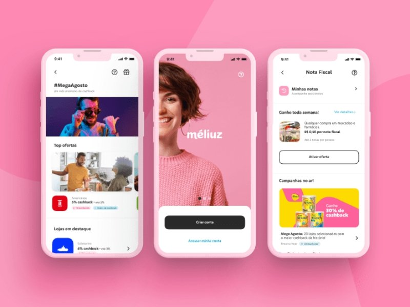
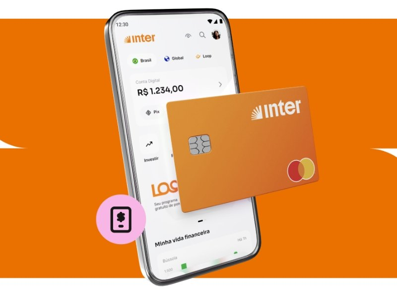

Olá, futuro detentor da sua liberdade financeira! Aqui é o Julio Mesquita, e se você está no **hotmoney.blog.br**, é porque, assim como eu, não gosta de deixar dinheiro na mesa.

A busca por uma **renda extra** pode parecer complexa, mas eu vou te provar que, com as ferramentas certas, ela pode ser _literalmente_ automática. Você já pensou em receber de volta uma parte do dinheiro que gasta em compras que faria de qualquer jeito?

É exatamente isso que os **aplicativos de cashback** fazem. Eles são, na minha opinião, a forma mais fácil e passiva de começar a "gerar uma grana a mais", como dizemos por aqui. Não é sobre vender algo ou trabalhar mais, é sobre ser inteligente com o seu consumo.

**Meu compromisso com você:** Eu, Julio, testei e usei cada um dos apps desta lista. Aqui, você só verá opções que **pagam de verdade** e que são confiáveis para o seu bolso. Vamos juntos descobrir como transformar suas compras em pequenas fontes de retorno financeiro!

## **O que é Cashback e Por Que Ele é Tão Importante para Sua Renda Extra?**

Vamos descomplicar. O termo _cashback_ significa, literalmente, "dinheiro de volta".

### **Como Funciona essa Mágica?**

1.  **Parceria:** Lojas (físicas ou online) fazem parcerias com plataformas de cashback.
2.  **Comissão:** Ao fazer uma compra através do link ou aplicativo parceiro, a loja paga uma comissão para a plataforma.
3.  **Devolução:** A plataforma _devolve_ uma porcentagem dessa comissão diretamente para você, o cliente.

Ou seja, você compra, a loja vende, a plataforma ganha um pouco e você ganha a sua parte. É um ciclo virtuoso de economia e renda extra passiva.

**Atenção do Julio:** Para quem busca renda extra, o **cashback vale a pena** e muito! Não se trata de um cupom de desconto futuro, mas sim de dinheiro líquido voltando para sua conta. Esse dinheiro pode ser usado para pagar contas, investir ou, claro, fazer aquela compra que você tanto queria!

**Leia também:** [O Que É Cashback? Aprenda Como Ter Seu Dinheiro de Volta e Turbinar Sua Renda Extra!](https://hotmoney.blog.br/o-que-e-cashback/)

## **Os 7 Melhores Aplicativos de Cashback para Usar Hoje**

Chegou a hora de armar o seu celular com as ferramentas certas. Estes são os apps que eu considero essenciais para qualquer pessoa que queira fazer o dinheiro voltar para o bolso.

### **1\. Méliuz: O Gigante que Não Pode Faltar no Seu Celular**

O **[Méliuz](https://www.meliuz.com.br/)** é, provavelmente, a primeira coisa que vem à mente quando se fala em cashback no Brasil. E com razão! Eles têm a maior variedade de lojas parceiras e são extremamente transparentes no processo.

-   **Vantagem Principal:** Enorme rede de lojas, incluindo grandes nomes como Amazon, Americanas, e grandes redes de eletrodomésticos.
-   **Como Maximizar:** Use a **Extensão de Navegador**. Ela te avisa automaticamente se a loja que você está visitando tem cashback, garantindo que você nunca se esqueça de ativar o benefício.
-   **Resgate:** Ao acumular R$ 20,00, você pode solicitar o resgate para sua conta corrente ou poupança via Pix, sem custo.

### **2\. Buscapé: Unindo Comparação de Preços e Dinheiro de Volta**

O **[Buscapé](https://www.buscape.com.br/)** fez o movimento inteligente de unir duas grandes necessidades do consumidor: saber se o preço está bom _e_ ganhar dinheiro de volta.

-   **Vantagem Principal:** Você compara preços em várias lojas e, na maioria das vezes, o preço já aparece com a porcentagem de cashback. É uma economia dupla!
-   **Ideal para:** Quem está pesquisando itens caros (eletrônicos, móveis) e não quer correr o risco de pagar mais caro _e_ perder o benefício.
-   **Dica Hotmoney:** Use o Buscapé junto com o Alerta de Preços. Quando o preço cair, ative o cashback e compre!

### **3\. Inter (Super App): Cashback na Conta e no Cartão**

Se você já é cliente do [Banco Inter](https://inter.co/), você tem uma mina de ouro de cashback no seu bolso. O Inter não é _apenas_ um aplicativo de cashback, mas o seu Super App oferece um Shopping próprio com ótimas taxas de retorno.

-   **Vantagem Principal:** O dinheiro volta diretamente para a sua conta Inter. Simples assim.
-   **Cashback no Cartão:** Muitos cartões Inter (como o Black) oferecem cashback automático em todas as suas compras, transformando o seu cartão de crédito em um gerador de retorno financeiro.

### **4\. Cuponomia: Onde o Cupom Encontra o Cashback**

O **[Cuponomia](https://www.cuponomia.com.br/extensao?utm_source=google&utm_medium=search&utm_term=cuponomia&kid=5004&gad_source=1&gad_campaignid=107155154&gbraid=0AAAAADtY3rbhAcxv0xDNrIdEClSU048zN&gclid=CjwKCAiAraXJBhBJEiwAjz7MZVIxQPo-Clcy0qHT16FTyTxlcFnE21AiaXVsCXlSxTCfygP-isH-TBoCBOwQAvD_BwE)** é forte em parcerias e em oferecer cupons de desconto que podem ser acumulados com o cashback.

-   **Vantagem Principal:** Possibilidade de usar um cupom para baixar o preço _e_ ainda ganhar uma porcentagem de volta.
-   **Foco:** Roupas, acessórios e cosméticos.

## **Cashback não é só para E-commerce: Opções para Supermercado e o Dia a Dia**

A experiência de quem busca renda extra sabe que os maiores gastos estão nas compras do dia a dia. Você não pode se dar ao luxo de deixar dinheiro na mesa nas idas ao mercado!

### **PicPay e Ame Digital: A Força das Contas Digitais**

O **PicPay** e o **Ame Digital** (Lojas Americanas/Submarino) são as grandes estrelas do cashback em lojas físicas.

-   **PicPay:** Vive lançando promoções de 10% ou mais em recarga de celular, pagamentos de boletos ou compras em lojas específicas. Fique de olho nas notificações!
-   **Ame Digital:** Se você compra muito nas lojas Americanas ou usa as plataformas parceiras, o saldo do Ame é praticamente uma segunda carteira digital, que você usa para abater em compras futuras.

## **Dicas de Especialista: Como o Julio Mesquita Maximiza o Seu Cashback (Renda Extra na Veia!)**

Depois de anos testando, errando e aprendendo (para que você não precise errar!), aqui estão minhas três dicas de ouro para transformar o cashback em uma fonte significativa de renda extra:

### **1\. Use a Extensão de Navegador, SEMPRE**

Não confie apenas na sua memória. Instale as extensões do Méliuz e Buscapé no seu computador. Quando você estiver navegando em um e-commerce, a extensão acenderá e te lembrará de ativar o cashback. É a garantia de que você nunca mais vai perder uma oportunidade por esquecimento.

### **2\. Acumule Cashback com Cupons de Desconto**

Quase sempre, é possível usar um cupom de desconto **e** ainda ganhar cashback. Por exemplo, você encontra um cupom de 10% no Cuponomia, aplica ele na loja, e ainda ativa 5% de cashback pelo Méliuz. É a lei da multiplicação financeira!

### **3\. Fique de Olho nas "Ofertas Turbo"**

Toda semana, os aplicativos destacam lojas com taxas de cashback absurdamente altas (15%, 20%, às vezes mais!). Se você já pretendia comprar algo, mas pode esperar um pouco, monitore estas ofertas. É nessas horas que o retorno financeiro salta e se torna uma renda extra considerável.

## **Qual é o Melhor Aplicativo de Cashback? (Spoiler: Aquele que Você Usa!)**

A verdade é que não existe um único "melhor app". O segredo da liberdade financeira é a **consistência**.

O melhor aplicativo de cashback para você é aquele que está instalado no seu celular, com a extensão no seu navegador, e que você se lembra de usar **em todas as compras**.

Lembre-se: Renda extra é construída de pequenos passos. 5% aqui, 10% ali. No final do ano, essa grana de volta pode ser o suficiente para aquela viagem, o pagamento de uma dívida, ou o início do seu primeiro investimento.

**Agora é com você:** Escolha 2 ou 3 aplicativos desta lista, baixe, instale as extensões e comece hoje mesmo a fazer seu dinheiro voltar para o bolso.
