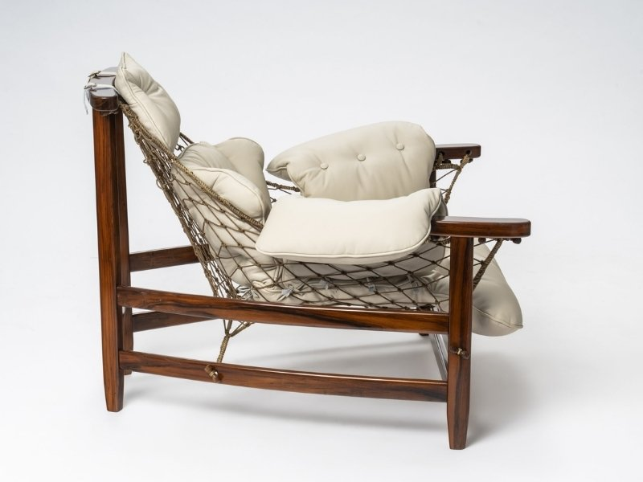

Se você é como eu, sabe que não existe sensação melhor do que chegar em casa e sentir que cada cantinho tem a nossa cara. Mas, vamos ser sinceros: quando olhamos os preços de **móveis e artigos para decoração** em grandes lojas de shopping, a vontade de redecorar passa rapidinho, não é?

Aqui no **Hotmoney**, eu sempre digo que a liberdade financeira passa pelas nossas escolhas de consumo. Por isso, hoje eu vou te mostrar que decorar não precisa ser um ralo de dinheiro. Pelo contrário: pode ser uma excelente fonte de **renda extra**.

Pegue seu café e vamos descobrir como garimpar estilo e transformar bom gosto em lucro!

**Leia também:** [Programa de Afiliados da Amazon: 5 Dicas Cruciais para Ter Sucesso](https://hotmoney.blog.br/programa-de-afiliados-da-amazon/)

## **O Segredo do Garimpo: Onde a Mágica Acontece**

Para quem quer economizar ou revender, o segredo não está nas vitrines famosas, mas em saber onde procurar. O mercado de **móveis de segunda mão** e artigos artesanais cresceu absurdamente.

### **1\. Outlets e Saldões de Fábrica**

Muitas lojas de alto padrão têm depósitos de "peças com pequenos detalhes". Às vezes é um arranhão imperceptível no pé de uma mesa que derruba o preço em 60%.

### **2\. Ouro Escondido: Design Assinado e Vintage**

Você já ouviu falar na **[Poltrona Jangada](https://osvaldoantiguidades.com.br/produto/poltrona-jangada-jean-gillon-2/)**? Criada pelo designer Jean Gillon, ela é um ícone do mobiliário brasileiro, feita de madeira jacarandá, couro e redes de pesca.

Por que estou te falando dela? Porque muitos herdeiros ou pessoas que estão limpando casas antigas não sabem o valor do que têm em mãos. Uma Poltrona Jangada original em um bazar de bairro pode custar uma fração do seu valor real de mercado (que chega a dezenas de milhares de reais em galerias). Estudar o design brasileiro é o primeiro passo para um garimpo profissional!

## **Transformando Decoração em Renda Extra**

Você já pensou em ser um "Furniture Flipper"? Esse termo está bombando e nada mais é do que **comprar, reformar e vender móveis**.

-   **O que buscar:** Cadeiras de design clássico, cômodas de madeira e espelhos com molduras trabalhadas.
-   **O toque de mestre:** Peças inspiradas no design modernista (como a estética da Jangada que mencionamos) estão em alta. Se você encontrar algo com linhas orgânicas e materiais naturais, agarre!
-   **Onde vender:** Instagram e plataformas especializadas em decoração vintage.

Isso é o que eu chamo de **dinheiro inteligente**: você exercita a criatividade, melhora o ambiente e ainda coloca uma grana no bolso.

## **Tendências que Cabem no Bolso (e Valorizam o Imóvel)**

Se o seu objetivo é decorar para morar ou para alugar (como no Airbnb), foque em **artigos de decoração** que trazem aconchego sem custar uma fortuna:

-   **Iluminação Amarela:** Abajures e fitas de LED mudam o clima de qualquer sala gastando pouco.
-   **Plantas (Urban Jungle):** O verde traz vida e é um dos itens de decoração mais baratos e valorizados atualmente.
-   **O "Statement Piece":** Tenha uma peça central de impacto. Pode não ser uma Poltrona Jangada original (ainda!), mas uma poltrona de madeira com design marcante já muda todo o "status" da sua sala.

## **Checklist para uma Compra Segura**

Antes de fechar qualquer negócio em sites de desapego, siga estes passos:

1.  **Meça tudo duas vezes:** Não há nada mais caro do que um móvel que não cabe na sua sala.
2.  **Verifique a estrutura:** Tecido a gente troca, mas cupim ou madeira podre é prejuízo na certa. Especialmente em peças de madeira maciça, olhe bem os cantinhos.
3.  **Negocie sempre:** No mundo dos usados, o preço inicial nunca é o final.

### **Conclusão: Sua Casa, Seu Investimento**

Decorar com **móveis e artigos de qualidade** não é sobre gastar muito, é sobre ter visão. Seja para criar um refúgio para sua família ou para iniciar um pequeno negócio de reforma e revenda, o importante é dar o primeiro passo com consciência financeira.

**E aí, qual desses caminhos você vai seguir?** Já pensou em encontrar uma raridade dessas perdida por aí? **Deixa um comentário aqui embaixo!** Vamos trocar essa ideia.

Um abraço e vamos rumo à liberdade financeira, **Julio Mesquita | Hotmoney**
