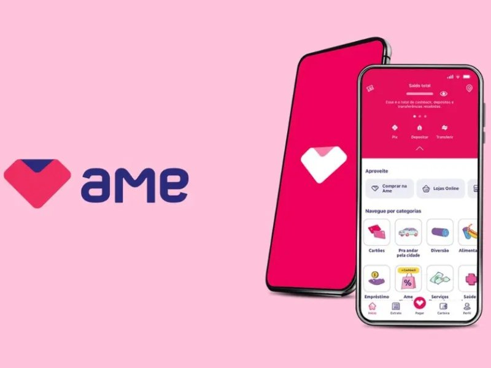

Olá! Meu nome é Julio Mesquita, e se você chegou até o **Hotmoney**, é porque está, assim como eu, na missão de fazer seu dinheiro render mais e conquistar a tão sonhada **liberdade financeira**.

Hoje, vamos desmistificar um dos melhores (e mais simples!) truques para aumentar sua renda sem ter que trabalhar mais: o **cashback**. Sabe aquela sensação de comprar algo e, dias depois, ver uma parte do valor voltando para o seu bolso? Pois é. É exatamente sobre isso que estamos falando!

Se você acha que cashback é complicado ou "bom demais para ser verdade", prepare-se. Vou te mostrar, com a experiência de quem já testou e lucrou com essa ferramenta, como ela funciona e, o principal, como você pode usá-la como uma poderosa aliada na sua jornada de **renda extra**.

### **Afinal, O Que Significa Cashback? A Definição Simples e Direta**

Vamos começar pelo básico. A palavra **Cashback** vem do inglês e a tradução literal é: **"dinheiro de volta"**. Simples assim.

Imagine que você está comprando uma camiseta online ou aquele eletrodoméstico que estava precisando. Ao invés de pagar R$100 e não receber nada em troca, você paga R$100 e, por usar um intermediário (como um aplicativo ou um cartão de crédito específico), a loja devolve, por exemplo, R$5 para você.

**Cashback não é desconto, é recompensa.** Você paga o valor total do produto no ato da compra e, depois de um tempo, recebe uma porcentagem desse valor de volta, diretamente na sua conta. É a loja te premiando por ter comprado através daquele canal.

É uma estratégia de marketing inteligente: a loja ganha um cliente, a plataforma intermediária ganha uma comissão, e você, nosso leitor inteligente do Hotmoney, **ganha dinheiro de volta**. Todos saem ganhando!

**Leia também:** [O que é educação financeira e por que você precisa dela](https://hotmoney.blog.br/o-que-e-educacao-financeira/)

### **Como Funciona o Cashback na Prática? O Caminho do Dinheiro de Volta**

Muita gente pensa que é mágica, mas é pura logística. O funcionamento do cashback é um processo de afiliação e comissão, e eu, como seu especialista aqui no Hotmoney, vou te explicar o **Passo a Passo** para você dominar essa técnica:

#### **O Processo em 3 Passos (Para Você Nunca Mais Ter Dúvida):**

1.  **A Ação (O Gatilho):** Você precisa _ativar_ o cashback. Isso geralmente acontece de duas formas:
    -   **Apps/Sites de Cashback:** Você entra no aplicativo (como Méliuz, Buscapé, etc.), procura a loja onde quer comprar e clica no link para ser redirecionado.
    -   **Cartões/Bancos:** Você usa um cartão de crédito ou débito que já possui o programa de cashback ativo.
2.  **A Compra e o Rastreio:** Você faz a compra normalmente no site da loja parceira. A plataforma de cashback rastreia sua compra (por isso é **MUITO** importante não fechar a janela ou clicar em outros links durante o processo!).
3.  **O Resgate (O Dinheiro no Bolso!):** Após o período de confirmação da loja (que é o tempo para você não desistir da compra), o valor do cashback é liberado como saldo para você. Na maioria das vezes, você pode transferir esse dinheiro **diretamente para sua conta bancária** (Pix ou TED).

**Pronto!** Você usou seu dinheiro para comprar algo necessário e, de quebra, garantiu uma **pequena renda extra** sem nenhum esforço.

### **Tipos de Cashback: Qual é o Melhor Para a Sua Renda Extra?**

Existem nuances no mundo do "dinheiro de volta". Para quem busca liberdade financeira, focar no dinheiro vivo é sempre a melhor estratégia.

#### **Cashback para Conta Corrente (Resgate em Dinheiro Vivo)**

**É o favorito do Hotmoney.** Este tipo é o mais versátil, pois o saldo acumulado pode ser resgatado e transferido para _qualquer_ conta bancária sua.

-   **Vantagem:** O dinheiro é **livre**. Você pode usá-lo para investir, pagar contas, completar o valor de uma compra maior ou, simplesmente, dar um up na sua reserva de emergência.
-   **Onde encontrar:** Plataformas especializadas (Méliuz) e alguns bancos digitais (Banco Inter).

#### **Cashback em Crédito (Uso Futuro na Mesma Loja/Plataforma)**

Neste modelo, o valor devolvido fica preso para ser usado apenas dentro daquela plataforma ou em parceiros específicos.

-   **Exemplo:** O cashback do Ame Digital só pode ser usado em novas compras em lojas parceiras.
-   **Vantagem:** Ótimo para quem compra muito em um único ecossistema.
-   **Desvantagem:** Não te dá a liberdade de resgatar o dinheiro para outra finalidade.

#### **Cashback em Pontos e Milhas**

É o modelo tradicional dos cartões de crédito. O percentual da sua compra é convertido em pontos ou milhas.

-   **Vantagem:** Ideal para quem viaja muito ou sabe negociar milhas.
-   **Desvantagem:** Exige um certo conhecimento para converter em dinheiro de forma vantajosa, mas ainda pode ser uma excelente **renda extra** para quem é expert em milhas!

### **Os Melhores Lugares Para Ganhar Cashback e Aumentar Sua Economia**

Se a sua meta é maximizar o retorno, você precisa estar nas plataformas certas.

#### **Aplicativos e Sites Especializados em Cashback (Os Gigantes)**

São os reis do cashback, pois focam 100% nisso e têm a maior rede de parceiros:

-   **Méliuz:** Um dos pioneiros no Brasil. O saldo é resgatável em dinheiro vivo após R$20 acumulados. Tem extensão para navegador que te lembra de ativar o cashback.
-   **Buscapé/Zoom:** Ótimos para comparar preços e ainda oferecem cashback em muitos varejistas. Perfeito para uma "compra inteligente".

#### **Bancos Digitais e Corretoras**

Muitas instituições financeiras já entenderam o poder do dinheiro de volta e o integraram aos seus serviços:

-   **Banco Inter:** Possui uma seção de _Shopping_ dentro do app que oferece cashback em diversas lojas, além de ter um cartão que devolve parte do dinheiro da fatura.
-   **C6 Bank / XP:** Também oferecem programas de cashback em seus cartões, geralmente atrelados à bandeira (Mastercard ou Visa) e ao volume de gastos.

### **As Pegadinhas do Cashback: 3 Coisas Que Você Precisa Saber Antes de Usar**

Toda estratégia financeira tem seus detalhes, e o cashback não é diferente. Minha **experiência real** com esses apps me ensinou que a transparência é tudo. Para que você tenha **confiabilidade** total, aqui estão os pontos de atenção:

1.  **O Prazo de Liberação:** O dinheiro não é devolvido na hora! O prazo de confirmação pode levar de 30 a 90 dias, pois depende da loja garantir que você não devolveu o produto. **Seja paciente.**
2.  **O Valor Mínimo para Resgate:** Muitas plataformas (como a Méliuz, que exige R$20) só permitem a transferência quando você atinge um saldo mínimo. Por isso, a dica é concentrar suas compras para resgatar mais rápido.
3.  **A Regra da Janela:** Se você ativar o link de cashback e, antes de finalizar a compra, visitar outro site ou clicar em outro anúncio, a comissão pode ser "roubada" por esse outro canal. **Ative o link e vá direto para a compra!**

### **Conclusão do Hotmoney: A Economia Inteligente Que Vira Renda Extra!**

O cashback é, sem dúvida, uma das formas mais passivas de fazer seu dinheiro render e, por consequência, garantir uma **renda extra** que, mês a mês, faz uma diferença brutal no seu orçamento.

Não se trata apenas de receber uma porcentagem de volta, mas de adotar uma **[mentalidade de riqueza](https://economia.uol.com.br/mais/pagbank/2023/10/21/conquistar-mentalidade-da-riqueza.htm)**: cada centavo economizado é um centavo ganho.

No Hotmoney, somos defensores das práticas que te colocam no controle das suas finanças. Comece hoje mesmo a usar os aplicativos de cashback e veja como é fácil transformar compras do dia a dia em um degrau para a sua **liberdade financeira**.
