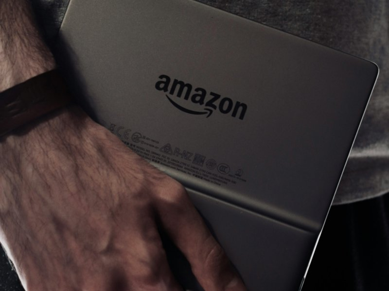
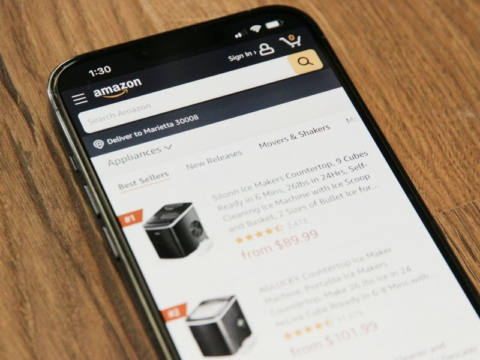

Você já pensou em transformar suas paixões em uma fonte de renda? O programa de afiliados da Amazon pode ser a chave para isso! Com milhões de produtos à sua disposição, as oportunidades são praticamente infinitas. Mas como se destacar nesse mar imenso de concorrentes e garantir que suas vendas realmente aconteçam?

Aqui estão cinco dicas cruciais que vão alavancar o seu sucesso na jornada do marketing de afiliados. Prepare-se para descobrir estratégias valiosas e descomplicadas que podem fazer toda a diferença no seu desempenho!

**Leia também:** [Minha Loja Caedu: Como Ganhar Dinheiro Promovendo Produtos!](https://hotmoney.blog.br/minha-loja-caedu/)

## 1\. Escolha um Nicho Altamente Específico

Escolher um nicho altamente específico é como encontrar o tesouro escondido no vasto oceano da internet. Quanto mais focado você for, menor será a concorrência e maior a chance de conquistar seu público-alvo. Pense em tópicos que você ama e que têm demanda, mas lembre-se: ser generalista pode ser um tiro no pé!
A famosa "cauda longa" é sua melhor amiga nessa jornada. Ao optar por subnichos, você se torna uma autoridade na área e atrai visitantes qualificados para seu conteúdo. Afinal, quem não quer dicas exclusivas sobre produtos específicos?

### Por que a "Cauda Longa" Vence a Concorrência?

A "cauda longa" é o segredo para vencer a concorrência no programa de afiliados da Amazon. Em vez de focar apenas em produtos populares, você pode explorar nichos menos saturados, onde há demanda específica e menos competição. Isso significa que seu conteúdo pode se destacar mais facilmente.
Ao escolher subnichos, você atrai um público-alvo engajado e interessado nas suas recomendações. Quanto mais específico for o seu foco, maiores são as chances de conversão. Afinal, pessoas buscam soluções únicas e personalizadas – e quem melhor para oferecê-las do que você?

### Como Validar o Potencial de um Subnicho

Para validar o potencial de um subnicho, comece fazendo uma pesquisa minuciosa. Utilize ferramentas como Google Trends e Keyword Planner para entender a popularidade das palavras-chave. Isso ajuda a descobrir se há interesse real nas soluções que você pretende oferecer.
Depois, mergulhe em fóruns e grupos de redes sociais relacionados ao seu subnicho. Observe as perguntas mais frequentes e as dores dos usuários. Essa interação pode revelar oportunidades incríveis para criar conteúdo relevante que atraia tráfego qualificado e converta leitores em compradores no programa de afiliados da Amazon.

## 2\. Crie Conteúdo de Review Profundo e Honesto

No universo do programa de afiliado da Amazon, um conteúdo de review bem elaborado pode ser o seu trunfo. Explore cada detalhe dos produtos que você está promovendo. Fale sobre prós e contras, funcionalidades e experiências pessoais. Isso gera confiança nos leitores.
A estrutura é essencial! Comece com uma introdução cativante, siga com a descrição das características do produto e finalize com uma opinião sincera. Use imagens atraentes para aumentar o engajamento e não esqueça de incluir chamadas à ação claras que incentivem a compra através dos seus links afiliados.

### A Estrutura de um Review de Alta Conversão

Um review de alta conversão vai além do que simples elogios. Comece com uma introdução atraente, contando uma história ou compartilhando uma experiência pessoal que conecte o leitor ao produto. Isso cria empatia e interesse desde o início.
Em seguida, forneça detalhes específicos sobre os benefícios e funcionalidades do item. Use listas para facilitar a leitura e inclua comparações com produtos similares. Imagens chamativas também ajudam a captar atenção. Lembre-se: autenticidade é crucial! Se você realmente acredita no produto, sua paixão transparecerá nas palavras, incentivando seus leitores a clicar no link de compra.

### Maximizando Palavras-Chave Transacionais

Para ter sucesso no programa de afiliado da Amazon, entender o poder das palavras-chave transacionais é vital. Essas expressões não são apenas palavras jogadas ao vento; elas refletem a intenção do usuário em realizar uma compra. Pense nelas como pequenos ímãs que atraem potenciais compradores diretamente para suas análises.
Incorpore essas palavras de forma natural em seu conteúdo. Utilize-as nos títulos, descrições e até nas chamadas para ação. Isso não só melhora sua classificação nos motores de busca, mas também aumenta as chances de conversão quando os leitores clicam nos seus links!

## 3\. Otimize para a “Janela de 24 Horas” da Amazon

Para ter sucesso no programa de afiliados da Amazon, é essencial entender a "janela de 24 horas" que envolve o uso de cookies. Isso significa que, após clicar em seu link, o cliente tem um dia para finalizar a compra e você receberá sua comissão. Aproveitar essa janela ao máximo pode ser uma estratégia poderosa!
Uma dica prática é incluir links diretos para produtos específicos em suas postagens. Assim, quando os visitantes clicarem e adicionarem itens ao carrinho rapidamente, suas chances de conversão aumentam. Lembre-se: cada segundo conta!

### Entendendo o Cookie e o Prazo de Duração

Os cookies são pequenos arquivos que a Amazon coloca no seu navegador ao clicar em um link de afiliado. Eles ajudam a rastrear as compras feitas por quem você indicou, garantindo que você receba sua comissão. Mas atenção: esses cookies têm prazo de validade!
Normalmente, o cookie da Amazon dura 24 horas. Isso significa que se alguém entrar na loja através do seu link e comprar algo dentro desse período, você ganha a comissão. Portanto, capriche nos links e incentive seus seguidores a não perderem essa janela de oportunidade!

### Estratégia de Links para o Carrinho de Compras

Quando se trata de aumentar suas vendas no programa de afiliado da Amazon, a estratégia de links para o carrinho de compras é um verdadeiro trunfo. Ao direcionar seus leitores diretamente ao carrinho, você facilita o processo e aumenta as chances deles finalizarem a compra. Quanto menos etapas eles tiverem que passar, melhor!
Imagine que seu visitante adora um produto específico e encontra seu link direto para ele já no carrinho. Isso elimina qualquer hesitação! A experiência do usuário fica mais fluida, e isso pode fazer toda a diferença nas conversões. É como colocar uma cereja do bolo na jornada de compra dos seus seguidores!

## 4\. Utilize as Ferramentas Nativas de Afiliados

Quando se trata de maximizar seus ganhos no programa de afiliado Amazon, as ferramentas nativas fazem toda a diferença. A SiteStripe é um verdadeiro trunfo! Com ela, você pode gerar links diretamente da página do produto sem complicações. Isso significa que mais tempo para criar conteúdo e menos tempo perdendo-se em menus.
E não podemos esquecer dos widgets e banners. Eles são ótimos para aumentar a visibilidade dos produtos que você está promovendo. Ao integrá-los ao seu site, você transforma sua página em uma vitrine irresistível. O resultado? Mais cliques e vendas na certa!

### O Poder da SiteStripe para Geração Rápida de Links

A SiteStripe é uma ferramenta incrível que facilita a vida dos afiliados da Amazon. Com ela, você pode gerar links de produtos em segundos, sem complicações. Imagine poder compartilhar aquele item irresistível com apenas um clique! É como ter superpoderes no mundo do marketing digital.
Além disso, a interface é tão intuitiva que até quem não tem experiência consegue usar. Basta navegar pelos produtos e clicar na barra superior para obter seu link personalizado. Isso significa mais tempo criando conteúdo e menos tempo lutando com ferramentas difíceis. Aproveite essa facilidade e veja sua receita crescer!

### Como os Widgets e Banners Aumentam a Visibilidade

Widgets e banners são verdadeiros aliados na busca pela visibilidade do seu conteúdo. Eles funcionam como pequenos pontos de atração, capturando a atenção dos visitantes enquanto navegam pelo seu site. Imagine um banner vibrante que destaca uma oferta imperdível da Amazon – difícil resistir, não é?
Além disso, esses elementos interativos proporcionam uma experiência mais dinâmica ao usuário. Ao clicar em um widget bem posicionado, o visitante pode ser direcionado facilmente para produtos relevantes. Isso não só aumenta as chances de conversão, mas também enriquece seu site com informações úteis e atrativas para seus leitores.

## 5\. Diversifique as Fontes de Tráfego e Links

Para maximizar seus ganhos no programa de afiliado Amazon, é vital diversificar as fontes de tráfego. Explore plataformas como YouTube e Pinterest, onde o conteúdo visual se destaca. Criar vídeos envolventes ou pins atraentes pode direcionar um fluxo constante de visitantes para seu site.
Além disso, não subestime o poder das redes sociais! Compartilhe suas avaliações e links em grupos relevantes ou faça parcerias com influenciadores. Quanto mais variados forem os canais que você utiliza, maior a chance de alcançar diferentes públicos e aumentar suas conversões.

### Integrando Conteúdo em Vídeo (YouTube) e Imagens (Pinterest)

O YouTube é uma mina de ouro para quem trabalha com o programa de afiliados da Amazon. Criar vídeos que mostram produtos em ação não só atrai visualizações, mas também gera engajamento. Imagine resenhas dinâmicas ou tutoriais práticos! Cada visualização pode se transformar em uma venda, então capriche na edição e no conteúdo.
Já o Pinterest é perfeito para imagens inspiradoras e infográficos. Você pode criar pins atraentes que direcionem os usuários diretamente para suas avaliações ou listas de produtos. Essa plataforma visual aumenta a chance de cliques, tornando seu trabalho ainda mais eficiente e divertido!

### Diretrizes de SEO: Usando Nofollow e Sponsored

Quando se trata de SEO, usar "nofollow" e "sponsored" é como ter um mapa do tesouro. Essas diretrizes ajudam a sinalizar aos motores de busca quais links você recomenda e quais são apenas colaborativos. Com o “nofollow”, você evita passar autoridade para sites que podem não valer a pena.
Já o “sponsored” é perfeito para parcerias pagas, mostrando transparência na sua estratégia. Usando essas etiquetas corretamente, você protege seu site e melhora sua classificação nas buscas. Afinal, quem não quer ser visto como uma fonte confiável?

## Perguntas Frequentes (FAQ) sobre o Programa Amazon

O Programa de Afiliados da Amazon gera muitas perguntas. Uma das mais comuns é sobre a média de comissão que os afiliados recebem. Essa taxa varia conforme o nicho, mas pode chegar até 10% em produtos específicos. É uma ótima maneira de monetizar seu conteúdo!
Outra dúvida frequente é se você pode usar links em redes sociais. A resposta é sim! Você pode compartilhar seus links nas plataformas sociais, desde que siga as diretrizes do programa. Isso aumenta suas chances de vendas e ajuda a construir sua presença online com facilidade!

### Qual a média de comissão do Afiliado Amazon?

Você já se perguntou qual é a média de comissão do Afiliado Amazon? A resposta pode variar, mas geralmente fica entre 1% e 10%, dependendo da categoria do produto. Itens como moda tendem a oferecer comissões mais baixas, enquanto eletrônicos podem trazer uma fatia maior para o seu bolso.
Porém, não se esqueça que esses números podem mudar! Fique sempre de olho nas promoções ou eventos especiais da Amazon. Às vezes, eles oferecem comissões turbinadas que fazem sua renda disparar. Então prepare-se e aproveite as oportunidades!

### Posso usar o programa de afiliados em redes sociais?

Sim, você pode usar o programa de [afiliados da Amazon](https://newfocus9.com/o-programa-de-afiliados/) nas redes sociais! É uma maneira incrível de compartilhar suas recomendações e ganhar comissões ao mesmo tempo. Imagine postar aquele link esperto para um produto que você ama enquanto interage com seus seguidores.
No entanto, fique atento às diretrizes da plataforma! Algumas redes têm regras específicas sobre links ou promoções. Sempre seja transparente e informe seu público sobre sua afiliação. Isso ajuda a construir confiança e a engajar ainda mais a sua audiência. Vamos lá, comece a compartilhar suas dicas e produtos favoritos!

## Conclusão: Comece a Construir sua Autoridade Hoje!

Construir sua autoridade no programa de afiliados da Amazon pode parecer desafiador, mas com as dicas certas, você estará no caminho do sucesso. Lembre-se sempre de escolher um nicho específico e criar conteúdo genuíno que ressoe com seu público. A otimização é crucial, assim como aproveitar ao máximo as ferramentas oferecidas pela Amazon.
Diversificar suas fontes de tráfego garantirá que você alcance mais pessoas interessadas nas suas recomendações. Então não espere mais! Coloque em prática tudo o que aprendeu e comece a jornada rumo à construção da sua autoridade hoje mesmo! O mundo das afiliações está esperando por você – vá lá e brilhe!
