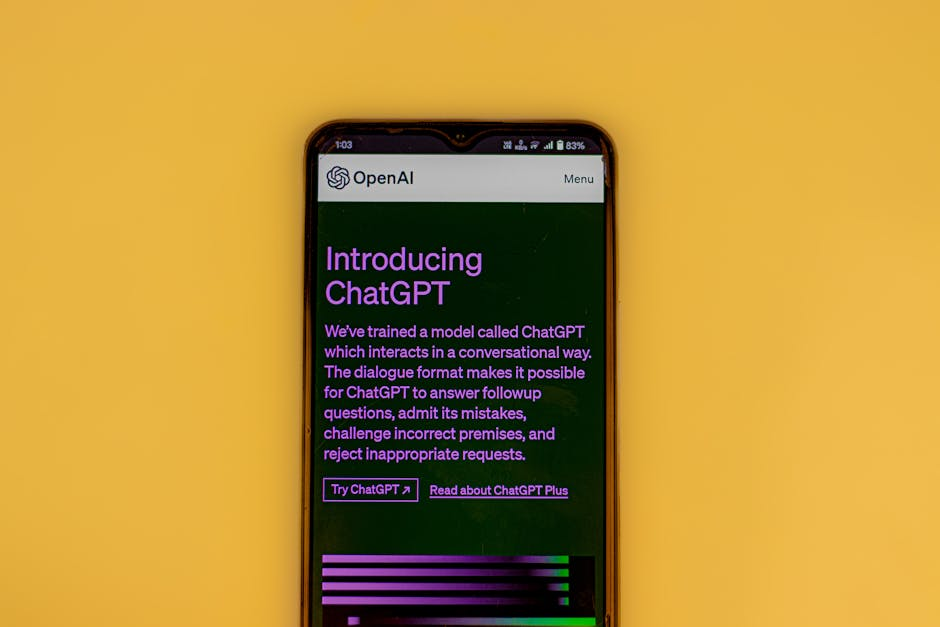

## O Que é a "Profissão" Prompt Engineer Freelancer?

Se você chegou até aqui, provavelmente já se perguntou como a inteligência artificial, especialmente o ChatGPT, pode se encaixar na sua rotina de trabalho. Pois bem, a resposta está na ascensão de uma nova "profissão": o **Prompt Engineer freelancer**. Mas o que isso significa na prática?

Basicamente, um Prompt Engineer é um especialista em se comunicar com IAs generativas, como o ChatGPT, de forma eficaz. Não é sobre programar, mas sim sobre _instruir_ a inteligência artificial com "prompts" (comandos, perguntas, textos) bem elaborados para obter os melhores resultados possíveis. Quando você se torna um Prompt Engineer freelancer, você transforma essa habilidade em serviços que pode vender, como copywriting, tradução, criação de conteúdo e muito mais.

A beleza dessa abordagem é que você não precisa ser um expert em programação ou um guru de marketing digital. Com a orientação certa e a curiosidade para testar e aprender, você pode dominar o ChatGPT e começar a oferecer soluções valiosas para clientes em plataformas como o 99Freelas, Workana ou Fiverr.

## Como o ChatGPT Pode Transformar Seus Serviços de Copywriting e Tradução?

A inteligência artificial generativa, como o ChatGPT, não veio para substituir a criatividade humana, mas para potencializá-la. Para freelancers de copywriting e tradução, isso se traduz em um aumento massivo de eficiência e qualidade. Vamos explorar como:

### Copywriting Aprimorado com IA

Imagine ter um assistente que pode gerar dezenas de ideias de títulos, desenvolver estruturas de texto persuasivas, otimizar sua copy para SEO e até mesmo criar variações de um mesmo anúncio em segundos. É exatamente isso que o ChatGPT oferece. Ao invés de gastar horas na “folha em branco”, você pode alimentar a IA com as informações do seu cliente (público-alvo, objetivo da campanha, características do produto) e obter esboços, argumentos de venda e chamadas para ação (CTAs) em tempo recorde. Seu trabalho, então, passa a ser refinar, humanizar e adicionar aquele toque estratégico que só você possui.

### Tradução Rápida e Precisa com Suporte de IA

Para tradutores, o ChatGPT pode ser um Game Changer. Ele consegue traduzir textos inteiros mantendo a coerência, a gramática e até mesmo o tom do idioma original. O grande diferencial aqui é a capacidade de contextualização que a IA oferece. Você pode não só traduzir, mas também pedir que o ChatGPT adapte a linguagem para um público específico (cultura, formalidade), reveja a fluência de uma frase ou até mesmo sugira sinônimos mais adequados para a cultura-alvo. Isso significa mais projetos, entregas mais rápidas e, consequentemente, mais dinheiro no seu bolso.

## Por Que Virar um Prompt Engineer Freelancer Agora?

A demanda por conteúdo de qualidade e adaptado ao ambiente digital é gigantesca e só cresce. Empresas de todos os tamanhos, profissionais de marketing e empreendedores individuais buscam formas de se comunicar de maneira eficaz com seus públicos. É aqui que o Prompt Engineer para freelancer entra em cena como uma solução valiosa. Aqui estão alguns motivos para você considerar essa carreira:

-   **Alta Demanda:** A necessidade de conteúdo e comunicação eficaz é constante no mundo digital.
    
-   **Vantagem Competitiva:** Ao dominar o ChatGPT, você oferece mais valor e agilidade do que seus concorrentes.
    
-   **Flexibilidade:** Trabalhe de onde quiser, com seus próprios horários e projetos que te interessam.
    
-   **Oportunidades de Aprendizado:** A IA está em constante evolução, o que significa um campo de conhecimento sempre novo e desafiador.
    
-   **Monetização Rápida:** Com as ferramentas certas e o conhecimento de como utilizá-las, você pode começar a gerar renda rapidamente.
    

## Tipos de Serviços que um Prompt Engineer Pode Oferecer em Plataformas Freelancer

Como Prompt Engineer freelancer, as possibilidades são vastas. Você não está limitado apenas a copywriting e tradução, mas pode explorar diversas frentes. Aqui estão alguns exemplos de serviços que você pode vender:

-   **Copywriting para Vendas:** Criação de anúncios, e-mails de marketing, legendas para redes sociais, scripts de vendas.
    
-   **Conteúdo para Blogs e Sites:** Produção de artigos, posts para blogs, descrições de produtos e serviços.
    
-   **Tradução e Localização:** Tradução de textos, documentos, websites, com adaptação cultural (localização).
    
-   **Criação de Conteúdo para Redes Sociais:** Geração de ideias de posts, legendas, roteiros para vídeos curtos.
    
-   **Revisão e Edição:** Polimento de textos, correção gramatical e otimização de estilo.
    
-   **Ideação e Brainstorming:** Auxiliar clientes a gerar ideias para campanhas, produtos ou conteúdos.
    
-   **Resumos e Análises:** Transformar grandes volumes de texto em resumos concisos ou identificar pontos-chave em documentos.
    

## Quanto Custa Começar e Quanto Ganha um Prompt Engineer?

Uma das melhores notícias sobre se tornar um Prompt Engineer freelancer é que o **custo para começar é mínimo**. Você basicamente precisará de:

-   **Acesso ao ChatGPT:** A versão gratuita já oferece muito valor para começar. A versão paga (ChatGPT Plus) oferece acesso mais rápido e recursos adicionais, mas não é um pré-requisito inicial.
    
-   **Computador com acesso à internet:** Provavelmente você já tem isso!
    
-   **Plataformas freelancer:** O cadastro em plataformas como 99Freelas é gratuito, embora algumas ofereçam planos pagos com mais visibilidade.
    
-   **Dedicação e Disposição para Aprender:** Este é o seu maior investimento!
    

Em relação a **quanto ganha um Prompt Engineer**, a resposta é: “depende”. Assim como qualquer freelancer, seus ganhos podem variar muito. No entanto, é um campo com grande potencial. Iniciantes podem cobrar por projeto ou por hora, dependendo da plataforma e da complexidade do trabalho. À medida que você ganha experiência e cria um portfólio, seus valores podem aumentar consideravelmente. Muitos freelancers experientes reportam ganhos significativos, especialmente aqueles que se especializam em nichos específicos ou que desenvolvem prompts muito complexos e eficientes.

## Como Começar a Vender Seus Serviços de Prompt Engineer no 99Freelas?

Pronto para dar o primeiro passo? Siga este guia prático para começar sua jornada como Prompt Engineer freelancer no 99Freelas:

### 1\. Entenda as Limitações e Potencial do ChatGPT

Antes de oferecer seus serviços, é crucial conhecer a ferramenta. Passe um tempo experimentando o ChatGPT. Peça para ele escrever diferentes tipos de textos, traduzir conteúdos, criar resumos. Entenda o que ele faz bem e onde ele precisa da sua intervenção humana para refinar. Quanto mais você pratica, melhores serão seus prompts e, consequentemente, seus resultados.

### 2\. Defina Seus Nichos e Serviços

Você vai focar em copywriting para e-commerce? Tradução de marketing? Geração de ideias para redes sociais? Ter um nicho ajuda a direcionar seus esforços e a atrair clientes específicos. No início, você pode oferecer uma gama mais ampla, mas a especialização tende a gerar mais autoridade e clientes bem segmentados.

### 3\. Crie um Portfólio Inicial (Mesmo que Fictício)

Usa o próprio ChatGPT para criar exemplos de trabalho. Desenvolva um post de blog, algumas copies de vendas e uma tradução. Isso serve para mostrar sua capacidade de gerar conteúdo de qualidade usando a ferramenta. Se você já tem algum trabalho de copywriting ou tradução, adapte-o para mostrar como o ChatGPT poderia ter otimizado o processo.

### 4\. Cadastre-se e Otimize Seu Perfil no 99Freelas

Preencha todas as informações do seu perfil com atenção. Destaque sua habilidade em usar IA, como o ChatGPT, para entregar resultados rápidos e eficientes. Use palavras-chave como "Prompt Engineer", "Copywriting com IA", "Tradução Assistida por IA". Inclua seu portfólio. Sua foto e uma descrição profissional também são essenciais.

### 5\. Busque Projetos Iniciais e Envie Propostas

Comece procurando por projetos que se encaixem nas suas habilidades. No início, pode ser vantajoso pegar alguns trabalhos com preços mais acessíveis para construir sua reputação e coletar avaliações positivas. Mantenha suas propostas personalizadas, mostrando ao cliente como você e o ChatGPT podem resolver o problema dele de forma única.

### 6\. Mantenha-se Atualizado e Busque Feedback

O mundo da IA e das plataformas freelancer muda rapidamente. Continue aprendendo sobre novas funcionalidades do ChatGPT, participe de comunidades e, o mais importante, peça feedback aos seus clientes. Isso não só ajuda a melhorar seus serviços, mas também a construir relacionamentos duradouros.

### Dica Extra: Demonstre o Valor da IA

Muitos clientes ainda não entendem o potencial da IA. Na sua comunicação, explique como você utiliza o ChatGPT para otimizar tempo, garantir qualidade e entregar resultados consistentes, sem, é claro, substituir a sua expertise humana e curadoria.

## Perguntas Frequentes Sobre o Prompt Engineer Freelancer

### O que é um Prompt Engineer e por que é importante para freelancers?

Um Prompt Engineer é um especialista em criar instruções eficazes (prompts) para IAs como o ChatGPT, a fim de obter os melhores resultados. Para freelancers, é importante porque permite automatizar tarefas, aumentar a produtividade e oferecer serviços de copywriting e tradução de alta qualidade em menos tempo, gerando mais lucro.

### Preciso saber programar para ser um Prompt Engineer?

Não, absolutamente não! A "profissão" de Prompt Engineer não exige conhecimentos de programação. O foco está na sua capacidade de se comunicar de forma clara e estratégica com a inteligência artificial, utilizando a linguagem natural.

### O ChatGPT vai substituir os freelancers de copywriting e tradução?

Não, o ChatGPT é uma ferramenta de apoio. Ele potencializa o trabalho do freelancer, libera tempo para tarefas mais estratégicas e ajuda a escalar a produção. A criatividade, a adaptação cultural, o toque humano e a visão estratégica do freelancer continuam sendo indispensáveis.

### Como o 99Freelas pode me ajudar a encontrar clientes?

O 99Freelas é uma plataforma onde clientes postam projetos e freelancers propõem seus serviços. Ao criar um perfil otimizado, com portfólio e descrições claras das suas habilidades como Prompt Engineer, você pode se candidatar a projetos de copywriting e tradução e ser contratado por clientes que buscam exatamente essas soluções.

### É possível ganhar dinheiro de verdade como Prompt Engineer freelancer?

Sim, é totalmente possível. Com dedicação, aprendizado contínuo e a construção de um bom portfólio e reputação, freelancers que dominam o Prompt Engineering podem ter ótimos ganhos, oferecendo serviços valiosos e eficientes para o mercado.

### Quais são os principais desafios de um Prompt Engineer freelancer?

Os principais desafios incluem aprimorar continuamente as habilidades de comunicação com a IA, manter-se atualizado com as evoluções tecnológicas, construir um portfólio sólido e gerenciar expectativas de clientes que podem não estar familiarizados com o uso da IA no processo.
