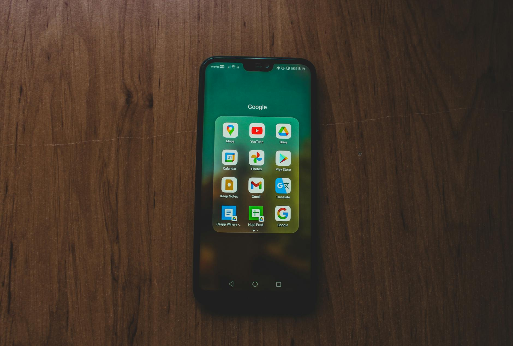

## Descubra Como Transformar Seu Smartphone em Uma Máquina de Ganhar Renda Extra

Quem nunca sonhou em transformar o tempo gasto no celular em dinheiro? A boa notícia é que, no cenário digital atual, isso não é mais um sonho distante, mas uma realidade acessível a todos. Com o avanço da tecnologia e a proliferação de smartphones, surgiram uma infinidade de **aplicativos de renda extra** que oferecem oportunidades diversas para complementar o orçamento, pagar dívidas ou até mesmo construir uma fonte de renda principal.

No HotMoney.blog.br, acreditamos que todos podem alcançar a liberdade financeira. Por isso, este artigo foi criado por Julio Mesquita para desvendar o universo da renda extra com aplicativos. Vamos explorar desde as opções mais populares até as menos conhecidas, fornecendo um guia completo e prático para você começar a faturar agora mesmo, usando apenas o seu smartphone.

Prepare-se para descobrir como otimizar seu tempo, seus talentos e até mesmo seus hobbies para gerar dinheiro extra de forma flexível e conveniente. Se você busca uma alternativa para aumentar seus ganhos sem sair de casa, ou onde quer que esteja, este guia é para você!

## Por Que os Aplicativos se Tornaram Uma Ferramenta Poderosa para Renda Extra?

A ascensão dos aplicativos como ferramenta de renda extra não é por acaso. Diversos fatores contribuíram para que eles se tornassem uma opção tão atraente:

-   **Acessibilidade:** Praticamente todo mundo possui um smartphone com acesso à internet, eliminando barreiras de entrada.
-   **Flexibilidade:** A maioria dos trabalhos e tarefas oferecidos por aplicativos pode ser realizada a qualquer hora e em qualquer lugar, adaptando-se à sua rotina.
-   **Variedade de Opções:** Existe uma vasta gama de aplicativos, atendendo a diferentes perfis, habilidades e necessidades.
-   **Baixo Investimento Inicial:** Geralmente, não é necessário investir dinheiro para começar, apenas seu tempo e dedicação.
-   **Escalabilidade:** Com dedicação e estratégia, é possível escalar seus ganhos e até mesmo transformar a renda extra em um negócio sólido.

Entender essa dinâmica é o primeiro passo para aproveitar ao máximo as [oportunidades de renda extra](https://www.hotmoney.blog.br/renda-extra) que o universo digital oferece. Vamos mergulhar nas principais categorias de aplicativos que podem te ajudar a alcançar seus objetivos financeiros.

## Categorias de Aplicativos para Ganhar Dinheiro no Celular

### 📖 Leia Também

-   [Desentupidora: O Guia para não entrar pelo cano (e como esse mercado pode render!)](/contratar-desentupidora)
-   [Como montar um serviço de desentupimento básico e faturar R$ 3.000 extras por mês](/como-montar-um-servico-de-desentupimento)

O mundo dos apps de renda extra é vasto e diversificado. Para facilitar sua jornada, organizamos as opções em categorias principais, com exemplos e dicas para cada uma.

### 1\. Apps de Pesquisas e Tarefas Simples

Esta é uma das formas mais acessíveis de começar a ganhar dinheiro com o celular. Embora os pagamentos por tarefa não sejam muito altos, a facilidade de execução e a baixa curva de aprendizado fazem desses apps um excelente ponto de partida.

#### O que são e como funcionam?

Esses aplicativos pagam por você responder pesquisas de mercado, assistir vídeos curtos, testar outros apps, visitar sites ou realizar microtarefas que exigem pouca ou nenhuma qualificação.

#### Principais Apps nesta Categoria:

-   **Google Opinion Rewards:** Paga por pesquisas rápidas do Google. O crédito geralmente é em Play Store, mas pode ser usado para comprar apps pagos ou itens em jogos. _(inline\_image\_terms: google opinion rewards, survey app)_
-   **PiniOn:** Plataforma brasileira que oferece missões em supermercados e pesquisas de opinião sobre produtos e serviços.
-   **Foap:** Venda suas fotos tiradas com o celular para marcas e agências.
-   **TaskRabbit:** Realize tarefas locais como montagem de móveis, limpeza ou entrega de encomendas (disponibilidade varia por região).
-   **TikTok / Kwai:** Ambos os aplicativos oferecem programas de recompensas onde você pode ganhar dinheiro assistindo vídeos, convidando amigos ou realizando desafios.

#### Dicas para Maximizar Ganhos:

-   **Seja consistente:** Acesse os apps diariamente para não perder novas tarefas.
-   **Responda com honestidade:** Isso aumenta suas chances de ser selecionado para mais pesquisas.
-   **Tenha paciência:** Os ganhos são cumulativos e demoram a se tornar substanciais.

### 2\. Apps de Vendas e Serviços

Se você tem algo para vender ou oferece algum tipo de serviço, esses aplicativos são ideais para conectar você a clientes em potencial. A demanda por esses serviços é alta e pode gerar uma renda significativa.

#### O que são e como funcionam?

Permitem que você divulgue produtos que não usa mais, crie sua própria loja virtual ou venda seus serviços especializados.

#### Principais Apps nesta Categoria:

-   **Enjoei:** Venda roupas, acessórios, eletrônicos e outros itens usados.
-   **Mercado Livre / OLX:** Anuncie produtos novos ou usados, veículos, imóveis e serviços.
-   **Airbnb:** Alugue um quarto, sua casa ou um espaço extra que você tenha para viajantes.
-   **GetNinjas:** Ofereça seus serviços (encanador, eletricista, diarista, professor, designer, etc.) e conecte-se a clientes que precisam.
-   **Workana / Fiverr:** Plataformas de freelancers onde você pode oferecer seus serviços digitais (criação de conteúdo, design, programação, tradução, etc.).

#### Dicas para Maximizar Ganhos:

-   **Boas fotos e descrições detalhadas:** Aumentam as chances de venda ou contratação.
-   **Ofereça um bom atendimento:** Crie uma boa reputação para atrair mais clientes.
-   **Defina preços competitivos:** Pesquise o mercado para precificar seus produtos/serviços adequadamente.
-   **Crie vários anúncios:** Quanto mais produtos ou serviços você oferecer, mais chances de ser encontrado.

### 3\. Apps de Entregas e Mobilidade

Se você tem um veículo (carro, moto ou bicicleta) e tempo livre, os aplicativos de entrega e mobilidade são uma excelente fonte de renda extra flexível. A demanda por esses serviços cresceu exponencialmente.

#### O que são e como funcionam?

São plataformas que conectam motoristas/entregadores a usuários que precisam de transporte ou recebimento de mercadorias.

#### Principais Apps nesta Categoria:

-   **Uber / 99:** Transporte de passageiros.
-   **iFood / Rappi / Zé Delivery:** Entrega de alimentos, bebidas e outros produtos.
-   **Loggi:** Entrega de encomendas e documentos.

#### Dicas para Maximizar Ganhos:

-   **Trabalhe em horários de pico:** Geralmente há mais demanda e tarifas dinâmicas mais altas.
-   **Conheça sua cidade:** Otimize suas rotas para economizar tempo e combustível.
-   **Mantenha seu veículo em boas condições:** Garante segurança e conforto para os clientes.
-   **Ofereça um bom atendimento:** Avaliações positivas são cruciais para continuar recebendo corridas/entregas.

### 4\. Apps de Cashbacks e Recompensas

Essa categoria não gera dinheiro diretamente, mas oferece _cashback_ (dinheiro de volta) ou pontos que podem ser trocados por produtos, passagens aéreas ou até mesmo dinheiro em conta. É uma forma inteligente de economizar e otimizar suas compras.

#### O que são e como funcionam?

Ao realizar compras através desses apps ou com cartões cadastrados, você recebe uma porcentagem do valor gasto de volta.

#### Principais Apps nesta Categoria:

-   **Méliuz:** Oferece cashback em compras online e físicas em diversas lojas parceiras.
-   **PicPay / RecargaPay:** Frequentemente oferecem cashback em pagamentos de contas, recargas e transações específicas.
-   **Ame Digital:** Cashback em compras nas lojas Americanas, Submarino, Shoptime, entre outras.

#### Dicas para Maximizar Ganhos:

-   **Conecte seus cartões:** Para ativar o cashback automático em lojas físicas.
-   **Use sempre que for comprar online:** Crie o hábito de verificar se há cashback antes de finalizar uma compra.
-   **Fique atento às promoções:** Muitos apps oferecem cashbacks dobrados ou ofertas especiais.

### 5\. Apps de Investimento e Finanças Pessoais

Embora não gerem renda extra por si só, esses aplicativos são fundamentais para quem busca [melhorar as finanças pessoais](https://www.hotmoney.blog.br/financas-pessoais) e fazer o dinheiro render. Alguns apps, no entanto, oferecem bônus por indicação ou por cumprir metas.

#### O que são e como funcionam?

Ajudam você a organizar suas finanças, investir seu dinheiro de forma inteligente e, em alguns casos, até mesmo ganhar um bônus por trazer novos usuários ou por cumprir desafios de economia.

#### Principais Apps nesta Categoria:

-   **Guiabolso / Olivia:** Organizadores financeiros que categorizam seus gastos e te ajudam a planejar seu orçamento.
-   **CDB/Renda Fixa de Bancos Digitais (Nubank, Inter, C6 Bank):** Muitos bancos digitais oferecem rendimentos diários em contas que podem ser uma forma de 'renda passiva'.
-   **Corretoras de Investimento (XP, Rico, Easynvest):** Permitem investir em ações, fundos imobiliários, CDBs, etc., diretamente pelo celular.

#### Dicas para Maximizar Ganhos:

-   **Comece a investir cedo:** Mesmo com pouco dinheiro, o poder dos juros compostos faz a diferença.
-   **Eduque-se financeiramente:** Entenda onde você está aplicando seu dinheiro.
-   **Aproveite bônus de indicação:** Muitos apps de investimento oferecem bônus ao indicar amigos.

## Estratégias Essenciais para Ter Sucesso com Renda Extra Via Aplicativos

Ter os aplicativos certos é apenas o começo. Para realmente transformar seu smartphone em uma ferramenta de lucro, você precisa de estratégia. _(inline\_image\_terms: money mobile app, earning app strategy)_

### 1\. Diversifique Suas Fontes de Renda

Não dependa de apenas um aplicativo. Cadastre-se em vários que se alinhem com seus interesses e habilidades. Se um app diminuir a demanda, você terá outras opções.

### 2\. Otimize Seu Tempo

Aproveite os momentos ociosos. Está esperando na fila? No transporte público? Use esse tempo para responder pesquisas, assistir vídeos ou organizar suas vendas.

### 3\. Crie Uma Rotina

Mesmo sendo flexível, ter um horário dedicado à renda extra ajuda na consistência e nos resultados. Pode ser uma hora por dia, algumas horas nos finais de semana, etc.

### 4\. Mantenha a Qualidade

Para apps de serviços e vendas, a reputação é tudo. Ofereça um serviço de excelência, com boas avaliações, para atrair mais clientes e aumentar seus ganhos.

### 5\. Monitore Seus Ganhos

Use uma planilha ou um aplicativo de finanças para registrar o quanto você está ganhando com cada app. Isso ajuda a identificar quais são os mais lucrativos e onde você deve focar mais seus esforços.

### 6\. Cuidado com Golpes

Evite apps que prometem ganhos exorbitantes e rápidos sem esforço. Sempre pesquise a reputação do aplicativo antes de fornecer seus dados pessoais ou investir qualquer quantia.

### 7\. Entenda as Regras de Cada App

Cada aplicativo tem suas próprias políticas de pagamento, termos de uso e formas de monetização. Leia-os atentamente para evitar surpresas.

## Como Receber o Dinheiro Ganho nos Aplicativos?

As formas de pagamento variam bastante entre os aplicativos. As mais comuns incluem:

-   **Transferência via Pix ou TED/DOC:** Direto para sua conta bancária.
-   **Carteiras Digitais (PayPal, PagBank):** Muitas plataformas utilizam essas carteiras como intermediárias.
-   **Créditos em lojas ou vales-presente:** Em alguns casos, especialmente apps de pesquisa, o ganho pode ser em créditos para lojas virtuais (Ex: Google Play Store, Amazon).
-   **Recarga de celular:** Algumas plataformas oferecem essa opção para valores menores.

Sempre verifique o valor mínimo para saque e os prazos de pagamento antes de começar a usar um aplicativo.

## FAQ: Perguntas Frequentes Sobre Renda Extra com Aplicativos

### É realmente possível ganhar dinheiro de verdade com apps?

**Sim, é totalmente possível.** Muitas pessoas complementam sua renda e até mesmo sustentam-se com a remuneração vinda de aplicativos. No entanto, é importante ter expectativas realistas. A maioria dos apps gera renda extra, não uma fortuna instantânea.

### Preciso investir dinheiro para começar a usar os apps de renda extra?

Na grande maioria dos casos, **não**. Apps de pesquisa, tarefas, vendas de itens usados e até mesmo alguns de serviços não exigem investimento inicial. Para apps de entrega e mobilidade, você precisará de um veículo, mas o aplicativo em si é gratuito. Aplicações de investimento, obviamente, requerem que você invista, mas o valor inicial pode ser bem baixo.

### Qual aplicativo paga mais rápido?

Isso varia muito. Apps de delivery e transporte geralmente pagam semanalmente. Apps de pesquisa e tarefas podem ter um valor mínimo de saque e demorar um pouco mais para atingir, mas uma vez atingido, o pagamento costuma ser rápido via Pix ou carteiras digitais. Sempre verifique as políticas de pagamento de cada app.

### Existem impostos sobre a renda extra de aplicativos?

Sim, rendas provenientes de aplicativos são tributáveis como qualquer outra. Se seus ganhos mensais ultrapassarem o limite de isenção estabelecido pela Receita Federal, você deverá declará-los. É sempre recomendado consultar um contador para entender suas obrigações fiscais.

### Posso fazer renda extra com apps no mesmo celular que uso normalmente?

**Com certeza!** A ideia é justamente essa: aproveitar o smartphone que você já possui. No entanto, é bom ter uma boa conexão de internet e um aparelho com bom desempenho para uma melhor experiência.

### Como faço para saber se um aplicativo é confiável?

Algumas dicas essenciais são:

-   **Pesquise a reputação:** Busque avaliações em lojas de aplicativos (Google Play, App Store), sites de reclamação (Reclame Aqui) e fóruns especializados.
-   **Verifique a segurança:** Veja se o app pede permissões excessivas ou informações desnecessárias.
-   **Cuidado com promessas milagrosas:** Apps que prometem dinheiro fácil e rápido demais quase sempre são golpes.
-   **Leia os termos de uso e privacidade:** Entenda como seus dados serão utilizados.

## Conclusão: Seu Smartphone é Uma Ferramenta Poderosa de Renda Extra

Chegamos ao final do nosso guia completo sobre renda extra com aplicativos. Como vimos, as oportunidades são vastas e acessíveis, permitindo que qualquer pessoa com um smartphone e acesso à internet possa começar a faturar.

O segredo está em **identificar suas habilidades**, **escolher os aplicativos certos** para seu perfil e **aplicar as estratégias** que compartilhamos. Lembre-se, consistência e dedicação são as chaves para transformar pequenas tarefas em ganhos significativos ao longo do tempo.

No HotMoney.blog.br, sob a curadoria de Julio Mesquita, estamos sempre em busca das melhores dicas e ferramentas para sua liberdade financeira. Explore as opções, comece hoje mesmo e descubra como seu smartphone pode ser seu novo parceiro na jornada rumo a uma vida financeira mais próspera.

Comece pequeno, mas comece. Cada centavo extra é um passo a mais em direção aos seus objetivos!
