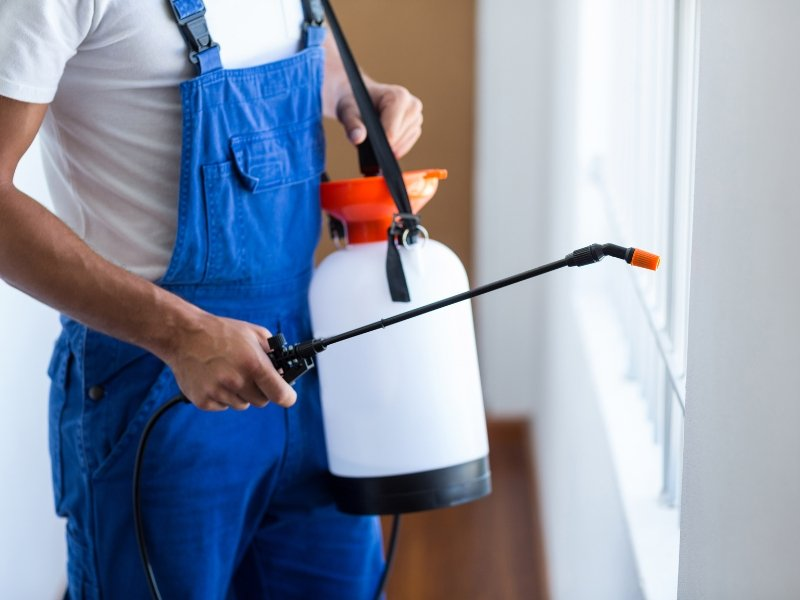
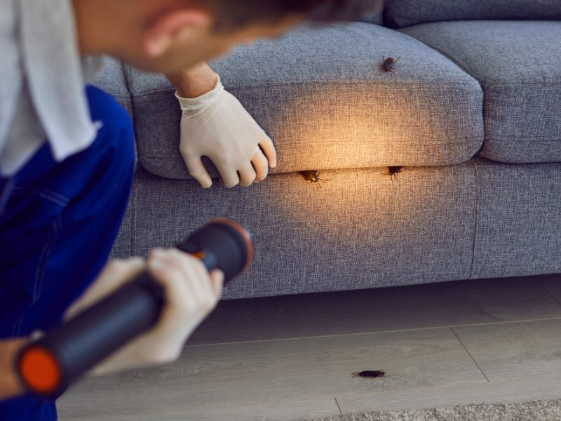

Você já pensou em ganhar uma renda extra com algo que pode fazer em casa? A dedetização caseira é uma excelente oportunidade! Com o aumento das infestações de pragas, muitas pessoas buscam soluções eficazes e acessíveis. Aprender a controlar insetos e roedores não só ajuda sua casa a ficar limpa e saudável, mas também pode se transformar em um serviço rentável.

Neste guia, você vai descobrir como oferecer serviços de controle de pragas em pequena escala, transformando seu conhecimento em lucro! Vamos lá?

## Entenda a Importância da Dedetização

A dedetização é essencial para manter um ambiente saudável. Pragas como baratas, formigas e ratos não apenas causam desconforto, mas também representam riscos à saúde. Elas podem transmitir doenças e contaminar alimentos.
Além disso, a presença de pragas pode danificar sua casa. Insetos como cupins destroem madeira, enquanto roedores podem causar problemas elétricos ao roer fios. Agir rapidamente é fundamental!
Por isso, investir na dedetização caseira se torna uma prioridade. Com técnicas simples e produtos acessíveis, você protege seu lar e ainda contribui para o bem-estar da sua família!

## Passo a Passo para Realizar uma Dedetização Caseira

Realizar uma dedetização caseira é simples e pode se tornar uma ótima fonte de renda extra. O primeiro passo é planejar tudo com cuidado, garantindo a segurança para você e os moradores do local.
Identifique qual praga está causando o problema; isso facilitará na escolha do método mais eficaz. Após entender a situação, prepare o ambiente, removendo móveis e objetos que possam ser afetados.
Escolha um produto adequado — seja caseiro ou comprado em lojas especializadas. Siga as instruções corretamente para garantir resultados satisfatórios sem riscos à saúde.

### Planejamento e Segurança

Um bom planejamento é essencial antes de iniciar a dedetização caseira. Avalie o ambiente e as áreas que precisam de atenção. Cada espaço pode exigir uma abordagem diferente, então observe bem.
A segurança deve estar em primeiro lugar. Utilize luvas, máscaras e óculos de proteção ao manusear produtos químicos ou receitas caseiras. Isso evita qualquer contato direto com substâncias que podem ser prejudiciais à saúde.
Além disso, mantenha crianças e pets afastados durante todo o processo. A prevenção é sempre melhor do que lidar com consequências indesejadas depois da aplicação dos produtos. Cuide para garantir um ambiente seguro para todos!

**Leia também:** [Guia Completo para Vender Doces e Salgados em Casa](https://hotmoney.blog.br/vender-doces-e-salgados-em-casa/)

#### Identifique a Praga

Identificar a praga é o primeiro passo para um controle eficaz. Observe atentamente seu ambiente e procure por sinais, como fezes, buracos ou danos em móveis. Cada tipo de inseto tem características distintas que podem ajudar na identificação.
Por exemplo, baratas são escuras e planas, enquanto formigas geralmente aparecem em filas organizadas. Conhecer as peculiaridades do inimigo facilita a escolha do método de [dedetização](https://dedetizadoraem.eco.br/d/) mais adequado.
Além disso, você pode consultar imagens online ou guias simples sobre pragas comuns. Quanto melhor você conhecer a praga com que está lidando, mais eficiente será sua abordagem na dedetização caseira.

#### Priorize a Segurança

Ao realizar uma dedetização caseira, a segurança deve ser sua prioridade. É fundamental proteger não apenas a si mesmo, mas também as pessoas e animais que convivem com você.
Use luvas e máscaras durante o processo para evitar contato direto com produtos químicos ou substâncias potencialmente perigosas. Além disso, mantenha crianças e pets longe da área até que tudo esteja completamente seguro.
Certifique-se de seguir todas as instruções do fabricante na hora de aplicar os produtos. Assim, você garante um ambiente protegido enquanto combate pragas indesejadas de maneira eficaz e responsável.

### Preparação do Ambiente

Antes de iniciar a dedetização caseira, é essencial preparar bem o ambiente. Comece retirando móveis e objetos do local que será tratado. Isso facilita a aplicação do produto e evita danos aos itens.
Em seguida, limpe a área com um pano úmido para remover sujeiras ou resíduos que possam interferir na eficácia do tratamento. Se houver alimentos expostos, guarde-os em recipientes fechados para evitar contaminação.
Por último, proteja plantas e animais de estimação durante o processo. Certifique-se de que eles estejam longe da área dedicada à dedetização até que tudo esteja seguro novamente. A preparação adequada faz toda a diferença no sucesso da operação!

### Escolha e Aplicação do Produto

Escolher o produto certo para a dedetização caseira é essencial. Você pode optar por receitas caseiras ou inseticidas de venda livre, dependendo da gravidade da infestação.
As receitas caseiras são uma alternativa segura e econômica, perfeitas para pragas leves. Misturas com vinagre, limão e bicarbonato podem funcionar bem como repelentes naturais.
Se a situação for mais grave, produtos químicos de venda livre podem ser necessários. Sempre siga as instruções do rótulo e use equipamentos de proteção adequados durante a aplicação. Isso ajuda a garantir sua segurança enquanto você combate as pragas indesejadas em casa.

#### Receitas Caseiras (Para Pragas Leves/Repelência)

As receitas caseiras são uma excelente alternativa para lidar com pragas leves e, ao mesmo tempo, evitam o uso excessivo de produtos químicos. Uma mistura eficaz é a água com vinagre. Em partes iguais, essa combinação atua como um repelente natural contra formigas e moscas.
Outra opção é usar detergente neutro diluído em água. Apenas algumas gotas misturadas podem ajudar a combater pulgões em plantas. A aplicação deve ser feita diretamente nas folhas afetadas.
Além disso, o óleo essencial de citronela também funciona bem como repelente. Misture algumas gotas em água e borrife nos ambientes desejados para afastar insetos indesejados.

#### Produtos de Venda Livre (Inseticidas Químicos)

Quando se trata de dedetização caseira, os inseticidas químicos são uma opção prática e eficaz. Eles estão disponíveis em supermercados e lojas especializadas, facilitando o acesso para quem precisa combater pragas.
Esses produtos geralmente vêm em spray ou granulado. A aplicação é simples, mas é fundamental seguir as instruções do fabricante para garantir a eficácia e a segurança.
Lembre-se de usar luvas e máscara durante a aplicação para evitar qualquer contato direto com os produtos. Com cuidado e atenção, você pode manter sua casa livre de intrusos indesejados!

### Pós-Aplicação

Após a aplicação do produto de dedetização, é importante ter alguns cuidados. Evite entrar nos ambientes tratados por pelo menos algumas horas. Isso garante que os ingredientes ativos tenham tempo para agir adequadamente.
Ventile bem os espaços, abrindo janelas e portas. A circulação de ar ajuda a dissipar qualquer resíduo químico ou odor desagradável, tornando o ambiente mais seguro novamente.
Fique atento a possíveis sinais de retorno das pragas nas semanas seguintes. Se notar alguma atividade suspeita, pode ser necessário repetir o processo ou ajustar as estratégias utilizadas na dedetização caseira.

### Medidas Preventivas (Fundamental)

Prevenir é sempre melhor do que remediar, e isso também se aplica ao controle de pragas. Manter a casa limpa e organizada é um passo fundamental. Resíduos de comida atraem insetos indesejados, então não esqueça de fechar bem os recipientes.
Outra dica importante é vedar frestas e buracos nas paredes. Isso impede que as pragas encontrem um caminho fácil para entrar em sua casa. Pequenos detalhes fazem uma grande diferença no combate às infestações.
Por último, a manutenção regular do jardim também ajuda bastante. Cortar gramas altas e remover folhas secas evita que insetos façam moradia nos arredores da sua residência.

## Dicas Úteis para Evitar Pragas e Infestações

Manter a casa limpa é essencial para evitar pragas. Certifique-se de que alimentos estejam bem armazenados e o lixo seja descartado regularmente. Pragas são atraídas por restos de comida, então não deixe migalhas pelo caminho.
Além disso, vedar frestas e buracos nas paredes pode fazer toda a diferença. Vistorie janelas e portas com frequência, garantindo que não haja espaços abertos onde insetos possam entrar.
Por fim, use plantas repelentes no jardim ou em vasos dentro de casa. Espécies como citronela e manjericão ajudam a afastar mosquitos e outros insetos indesejados. A natureza tem suas maneiras!

## Conclusão

A dedetização caseira é uma ótima alternativa para quem busca renda extra e, ao mesmo tempo, quer ajudar amigos e familiares a resolver problemas com pragas. Ao seguir os passos mencionados e priorizar a segurança, você poderá oferecer um serviço valioso na sua comunidade.
Lembre-se de que a prevenção é sempre o melhor remédio. Com as dicas práticas para evitar infestações, você não apenas ganha dinheiro, mas também contribui para um ambiente mais saudável. Que tal começar hoje mesmo? Boa sorte nessa nova jornada!
