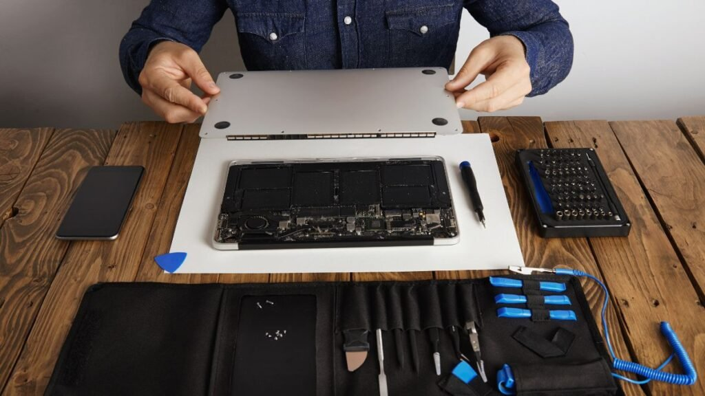

Você já imaginou transformar seu hobby em uma fonte de renda extra? No mundo dos consertos, há uma mina de ouro esperando por você: os MacBooks. Com a crescente demanda por reparos e a dificuldade que muitos enfrentam para encontrar assistência autorizada acessível, essa pode ser sua oportunidade perfeita! Consertar MacBooks em casa não só é viável como também financeiramente recompensador. Vamos explorar juntos como dar os primeiros passos nessa jornada lucrativa e se tornar o “mestre dos reparos” no conforto do seu lar!

## Por Que Consertar MacBooks é a Nova Mina de Ouro da Renda Extra?

Consertar MacBooks se tornou a bola da vez para quem busca uma renda extra. Com tantos usuários apaixonados pela Apple, os problemas nos dispositivos surgem com frequência. E você sabe o que acontece? A assistência autorizada é cara e muitas vezes demora semanas para entregar o produto de volta. Isso deixa os clientes frustrados e prontos para buscar alternativas mais rápidas e acessíveis.
Aqui entra você! Ao oferecer serviços de reparo em casa, pode conquistar um público fiel e preocupado com seu bolso. Além disso, as margens de lucro são altas, tornando essa atividade extremamente atraente.

**Leia também:** [10 Formas de Fazer Renda Extra Usando o ChatGPT (e Outras IAs) em 2025](https://hotmoney.blog.br/fazer-renda-extra-usando-o-chatgpt/)

### O Problema: Assistência Autorizada Cara e Lenta

Quem nunca ficou frustrado ao levar o MacBook para assistência autorizada? O preço parece um assalto à mão armada, e a espera é interminável. Você deixa seu computador lá, como se estivesse entregando uma parte da sua alma, mas sem saber quando ele vai voltar.
Enquanto isso, você observa outros clientes saindo com sorrisos nervosos e suas contas bancárias murchas. A verdade é que as assistências oficiais podem ser caras e lentas, deixando muitos usuários desesperados por alternativas mais rápidas e acessíveis. E adivinha? Essa frustração pode ser a sua chance de faturar!

### A Demanda Crescente por Profissionais de Confiança (e Mais Baratos)

Nos últimos anos, consertar MacBooks se tornou uma necessidade urgente. A assistência autorizada é cara e lenta, deixando muitos usuários frustrados. Eles buscam alternativas mais acessíveis e confiáveis para resolver seus problemas tecnológicos. Esse cenário abriu espaço para quem tem o talento e a disposição de ajudar.
Além disso, cada vez mais pessoas estão dispostas a confiar em profissionais independentes. Se você consegue oferecer um serviço de qualidade a um preço justo, está no caminho certo do sucesso! As redes sociais também ajudam na divulgação boca-a-boca dessas soluções econômicas.

### Seu Lucro Garantido: A Alta Margem de Reparos

Consertar MacBooks não é apenas uma habilidade valiosa; é uma verdadeira mina de ouro! A alta margem de reparos significa que você pode cobrar preços justos, mas ainda assim ter um lucro impressionante. Um simples conserto na tela ou troca da bateria pode render até 70% de retorno sobre o investimento.
Imagine isso: enquanto muitos gastam horrores em assistência autorizada, você oferece soluções rápidas e eficazes. Isso atrai clientes que valorizam qualidade sem quebrar o banco. Com tanto potencial financeiro, por que não começar a explorar esse nicho agora mesmo?

## O Guia Zero ao R$ 5.000: Primeiros Passos no Reparo de MacBooks

Começar a consertar MacBooks é mais fácil do que você imagina. O primeiro passo é entender os problemas comuns, como troca de bateria ou limpeza interna. Esses reparos simples podem garantir um retorno financeiro rápido e ajudar você a ganhar confiança nas suas habilidades.
Com o tempo, você pode expandir seu conhecimento para questões mais complexas. Investir em cursos online gratuitos ou tutoriais no YouTube vai fazer maravilhas. Lembre-se: cada conserto bem-sucedido não só enche seu bolso, mas também fortalece sua reputação na comunidade local!

### Reparos Nível 1: Onde o Iniciante Começa a Faturar Rápido

Se você está começando no mundo dos reparos de MacBooks, os consertos mais simples são a sua porta de entrada. Trocas de bateria e substituições de teclado são ótimas opções para faturar rápido. Esses serviços exigem ferramentas básicas e pouco tempo, ideal para quem ainda está aprendendo.
Além disso, ao realizar esses reparos iniciais, você ganha confiança e prática. Clientes satisfeitos podem até indicar seus serviços a amigos! Então mãos à obra: comece com o básico e veja seu negócio crescer rapidamente enquanto aprende cada vez mais sobre o fascinante universo dos MacBooks.

### Seu Kit de Ferramentas: Baixo Investimento, Alto Retorno

Montar seu kit de ferramentas para consertar MacBooks é mais fácil do que parece. Com um investimento inicial baixo, você pode adquirir chaves específicas, pinças e até uma estação de solda. Esses itens são essenciais e valem cada centavo quando o assunto é eficiência no reparo.
Além disso, não esqueça das ferramentas digitais! Tutoriais online são ótimos aliados nessa jornada. A combinação de ferramentas físicas com conhecimento adquirido pode transformar pequenos consertos em lucros significativos. Prepare-se para ver seu esforço se refletir na sua conta bancária!

### Onde Encontrar Peças de Reposição de Qualidade (e Baratas!)

Encontrar peças de reposição para conserts de MacBooks pode parecer um desafio, mas é mais fácil do que você imagina! Comece explorando sites como Mercado Livre e OLX. Esses marketplaces estão cheios de vendedores oferecendo desde baterias até telas com preços bem acessíveis.
Outra dica valiosa é participar de fóruns e grupos no Facebook dedicados a tecnologia. Muitas vezes, membros compartilham contatos confiáveis ou até vendem suas próprias peças. Assim, além de economizar, você ainda ajuda um colega na jornada do conserto!

## Estratégias de Marketing de Guerrilha para Garantir Clientes Imediatos

Atrair clientes para os seus serviços de [conserto de MacBook](https://speedtechrj.com.br/servicos/conserto-de-macbook-no-rj/) pode ser mais fácil do que você imagina. Que tal explorar grupos locais no Facebook? Poste sobre suas habilidades e ofereça promoções especiais. As pessoas adoram indicações, então faça um anúncio chamativo e garanta que sua mensagem chegue ao público certo.
Outra estratégia poderosa é usar os classificados online. Anúncios simples podem gerar uma onda de interesse imediato. E não se esqueça da importância dos depoimentos! Clientes satisfeitos são seu melhor cartão de visita; peça a eles para compartilhar suas experiências nas redes sociais.

### A Arte de Vender Sem Sair de Casa: Classificados e Grupos Locais

Vender consertos de MacBooks sem sair de casa é mais fácil do que você imagina. Os classificados online são verdadeiras minas de ouro! Basta criar um anúncio chamativo e colocar suas habilidades em destaque. Use imagens antes e depois para impressionar os potenciais clientes.
Grupos locais nas redes sociais também são ótimos pontos de partida. Compartilhe seu trabalho, responda perguntas e interaja com a comunidade. A confiança cresce quando as pessoas veem você como uma referência no assunto. Assim, sua agenda vai se encher rapidamente com novos serviços!

### O Poder da Prova Social: Peça Depoimentos e Indique a Economia

Depoimentos são como ouro na hora de conquistar novos clientes. Quando alguém vê que outra pessoa teve uma experiência positiva, a confiança cresce instantaneamente. Portanto, não hesite em pedir feedback dos seus primeiros consertos! Um simples "Você pode me dar um depoimento?" pode fazer maravilhas.
E que tal indicar quanto seu cliente economizou com seu serviço? Mostrar a diferença entre o preço da assistência autorizada e o seu reparo vai atraí-los ainda mais. Use essa estratégia e veja sua clientela aumentar rapidamente!

### Defina Sua Tabela de Preços para Ser Lucrativo e Competitivo

Definir sua tabela de preços pode parecer um desafio, mas é fundamental para se destacar no mercado. Pesquise o que os concorrentes estão cobrando, mas não tenha medo de ajustar seus valores com base na qualidade do seu serviço. Lembre-se: você está oferecendo algo especial!
Considere também a complexidade dos reparos e seu tempo de trabalho ao estipular os preços. Seja transparente com seus clientes sobre o valor que eles receberão em troca. Isso cria confiança e pode transformar uma simples assistência em uma fonte constante de renda extra.

## O Caminho para a Liberdade Financeira: Evoluindo para o Reparo de Placa Lógica

Se você já está consertando MacBooks e sentiu que pode ir além, o reparo de placa lógica é a próxima grande jogada. Esse tipo de serviço não só aumenta seu conhecimento técnico, como também potenciais ganhos. Imagine resolver problemas complexos que muitos profissionais evitam!
Aprender essa habilidade transforma você em um verdadeiro especialista do setor. Com a demanda crescente por esse tipo de reparo, sua clientela vai aumentar e seus lucros podem disparar. É um passo importante rumo à liberdade financeira tão sonhada!

### Por Que o Reparo de Placa é o Upgrade de Renda Mais Valioso

O reparo de placa lógica é onde a mágica acontece. Se você já se aventurou em consertar MacBooks, sabe que muitos problemas estão escondidos nas entranhas das placas. Resolver isso pode transformar um cliente frustrado em fã ardoroso do seu trabalho.
Além disso, os lucros são significativamente maiores. Um pequeno investimento em ferramentas e aprendizado pode render uma grana boa com poucos reparos. E quem não gostaria de ser reconhecido como o “mestre dos consertos”? É hora de abrir as portas para essa nova oportunidade!

### Cursos e Recursos para Levar Sua Habilidade ao Próximo Nível

Investir em cursos online é uma das melhores maneiras de alavancar suas habilidades no conserto de MacBooks. Plataformas como Udemy e Coursera oferecem aulas específicas sobre diagnóstico, reparo e manutenção. Além disso, muitos desses cursos são disponíveis a preços acessíveis ou até gratuitos.
Não esqueça também dos fóruns e comunidades na internet! Nele, você encontra dicas valiosas de profissionais experientes que compartilham segredos do ofício. Participar dessas redes pode ser um grande diferencial para quem deseja se destacar no mercado competitivo de consertos.

## Conclusão: Transforme Sua Habilidade em Sua Próxima Fonte de Renda Principal

Transformar sua habilidade em consertar MacBooks pode ser a chave para uma nova fonte de renda. Imagine ter um negócio próprio, trabalhando no conforto da sua casa e ajudando pessoas que precisam de assistência técnica com seus dispositivos. É uma oportunidade incrível.
O mundo está mudando e cada vez mais as pessoas buscam soluções rápidas e acessíveis. Ao se especializar nesse nicho, você não apenas ganha dinheiro, mas também constrói uma reputação como um profissional confiável.
Seja o solucionador de problemas na vida dos outros! A satisfação de entregar um MacBook funcionando perfeitamente é imensurável. E lembre-se: quanto mais você aprende, mais valioso se torna no mercado. Portanto, pegue suas ferramentas e comece agora mesmo essa jornada rumo à liberdade financeira!
Seu futuro financeiro pode estar nas suas mãos – literalmente!
