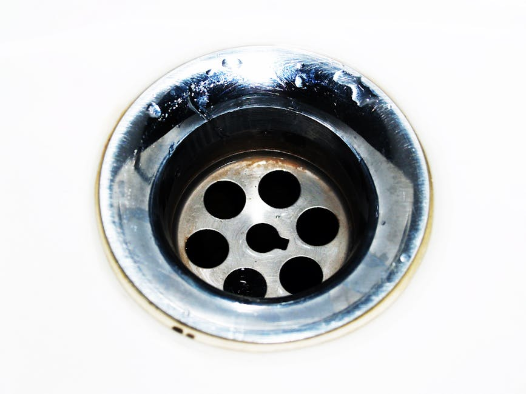

## O Que São Serviços de Desentupimento e Controle Ambiental?

Você já se viu diante de um ralo entupido que não desce de jeito nenhum? Ou percebeu a presença incômoda de pragas em sua casa ou ambiente de trabalho? Essas situações, além de desagradáveis, podem trazer sérios riscos à saúde e ao bem-estar. É aqui que entram os **serviços de desentupimento e controle ambiental** – uma solução completa e essencial para manter seu espaço seguro, limpo e funcional.

Mas o que exatamente esses serviços englobam? Basicamente, estamos falando de um conjunto de ações especializadas que visam resolver problemas de obstrução em tubulações e sistemas de esgoto, bem como gerenciar e eliminar pragas urbanas e vetores de doenças. Mais do que apenas “resolver o apertado”, essas atividades são fundamentais para a saúde pública e a conservação do meio ambiente.

No HotMoney.blog.br, acreditamos que ter um ambiente saudável e livre de preocupações é o primeiro passo para a tranquilidade financeira e pessoal. Por isso, preparamos este guia completo para você entender a importância desses serviços e como eles podem impactar sua vida positivamente.

## Por Que Investir em Desentupimento e Controle Ambiental?

Investir em [**serviços de desentupimento e controle ambiental**](https://limpafossaem.com.br/) não é um gasto, mas sim um investimento inteligente na sua qualidade de vida, patrimônio e saúde. As consequências de negligenciar esses aspectos podem ser muito mais caras e prejudiciais a longo prazo. Vamos entender os principais motivos:

### 1\. Saúde e Bem-Estar

Obstruções em tubulações podem causar refluxo de esgoto, proliferação de bactérias e mau cheiro, atraindo insetos e roedores. Da mesma forma, pragas como baratas, ratos, mosquitos e formigas são vetores de diversas doenças, como leptospirose, dengue, salmonella e muitas outras. O controle ambiental proativo e o desentupimento eficiente eliminam esses riscos, protegendo você e sua família.

### 2\. Prevenção de Danos Estruturais

Um pequeno vazamento ou entupimento pode evoluir para problemas maiores, como infiltrações, danos na estrutura do imóvel e na alvenaria, quebras de tubulações e descarte inadequado de resíduos. Reparar esses danos pode gerar custos altíssimos. A manutenção preventiva e a rápida resolução de entupimentos evitam essas complicações.

### 3\. Economia a Longo Prazo

Pode parecer contraditório, mas contratar uma empresa especializada para desentupimentos e controle de pragas é mais econômico do que tentar resolver por conta própria ou esperar o problema se agravar. Soluções caseiras para entupimentos muitas vezes são ineficazes e podem danificar as tubulações. Já a infestação de pragas fora de controle exige intervenções mais complexas e caras. Prevenir é sempre mais barato do que remediar.

### 4\. Conforto e Qualidade de Vida

Imagine não ter que se preocupar com água acumulada no chuveiro, pia entupida ou a presença indesejada de insetos. Um ambiente livre desses problemas proporciona mais conforto, higiene e tranquilidade no seu dia a dia.

### 5\. Sustentabilidade e Meio Ambiente

Empresas sérias de controle ambiental utilizam produtos e técnicas que minimizam o impacto no meio ambiente. Além disso, o desentupimento correto e a manutenção de redes de esgoto evitam a contaminação do solo e da água, contribuindo para a sustentabilidade e a saúde do ecossistema local.

## Tipos de Serviços e Modalidades Disponíveis

Os **serviços de desentupimento e controle ambiental** são vastos e podem ser adaptados às suas necessidades específicas. Conheça as principais categorias:

### Serviços de Desentupimento

-   **Desentupimento de Pias e Ralos:** Resolve obstruções comuns em cozinhas e banheiros, causadas por gordura, cabelos e restos de alimentos.
    
-   **Desentupimento de Vasos Sanitários:** Soluciona bloqueios que impedem o escoamento correto da água na louça sanitária.
    
-   **Desentupimento de Esgotos e Redes Pluviais:** Problemas mais complexos que afetam toda a rede coletora de efluentes ou águas da chuva.
    
-   **Desentupimento de Caixas de Gordura:** Manutenção essencial para restaurantes, bares e residências, removendo o acúmulo de gordura que pode causar mau cheiro e obstruções.
    
-   **Hidrojateamento:** Técnica poderosa que utiliza jatos de água de alta pressão para remover os bloqueios mais顽固os e realizar limpeza de tubulações.
    
-   **Vídeo Inspeção:** Permite visualizar o interior das tubulações com uma câmera, identificando a natureza e a localização exata do problema sem a necessidade de quebrar paredes.
    

### Serviços de Controle Ambiental (Controle de Pragas)

-   **Desinsetização (Controle de Insetos):** Eliminação e controle de baratas, formigas, mosquitos, pulgas, carrapatos, aranhas e outros insetos rasteiros ou voadores.
    
-   **Desratização (Controle de Roedores):** Métodos para combater ratos e camundongos, que são vetores de doenças e causam prejuízos materiais.
    
-   **Descupinização (Controle de Cupins):** Tratamento específico para eliminar cupins de solo, cupins de madeira seca e brocas, protegendo móveis e estruturas.
    
-   **Controle de Pombos e Morcegos:** Técnicas para afastar essas aves e mamíferos de forma segura e ética, prevenindo doenças e danos.
    
-   **Manejo Integrado de Pragas (MIP):** Abordagem completa que combina diversas técnicas para gerenciar e prevenir infestações, com foco na sustentabilidade.
    
-   **Sanitização e Desinfecção de Ambientes:** Processos para eliminar microrganismos nocivos, como vírus e bactérias, em ambientes residenciais, comerciais e industriais.
    

## Como Começar: Escolhendo a Empresa Certa

Agora que você entende a importância e os tipos de **serviços de desentupimento e controle ambiental**, o próximo passo é saber como escolher a empresa ideal. A qualidade e a confiança do prestador de serviço são cruciais para garantir a eficácia e a segurança dos tratamentos.

### 1\. Pesquise e Compare

Não contrate a primeira empresa que encontrar. Pesquise por empresas da sua região, verifique a reputação online (Google Reviews, Reclame Aqui) e peça indicações a amigos e familiares. Compare orçamentos, mas lembre-se que o menor preço nem sempre significa a melhor solução.

### 2\. Verifique a Licença e Certificações

Uma empresa séria de controle de pragas deve possuir licença da Vigilância Sanitária e do órgão ambiental competente. Para desentupimento, é importante que sigam as normas técnicas e de segurança adequadas. Não hesite em solicitar essas comprovações.

### 3\. Experiência e Equipe Técnica

Prefira empresas com anos de experiência no mercado. Uma equipe técnica qualificada, com profissionais treinados e que utilizam EPIs (Equipamentos de Proteção Individual), faz toda a diferença na qualidade e segurança do serviço.

### 4\. Produtos e Técnicas Utilizadas

Para o controle de pragas, certifique-se de que a empresa utiliza produtos regulamentados pela Anvisa e que são seguros para pessoas, animais de estimação e o meio ambiente. Para desentupimento, informe-se sobre as tecnologias empregadas (hidrojateamento, vídeo inspeção, etc.).

### 5\. Contrato e Garantia

Exija um contrato de prestação de serviços detalhado, que especifique o tipo de serviço, produtos utilizados, prazos, condições de pagamento e, principalmente, a garantia. Uma boa empresa oferece garantia pós-serviço, caso o problema ou infestação retorne dentro de um período.

### 6\. Atendimento e Suporte

Observe como a empresa se comunica com você. Um bom atendimento, transparência nas informações e a disponibilidade para tirar dúvidas são sinais de profissionalismo e respeito ao cliente.

## Perguntas Frequentes Sobre Desentupimento e Controle Ambiental

### Quais são os sinais de que preciso de serviços de desentupimento?

Os sinais mais comuns incluem água escoando lentamente em pias e ralos, mau cheiro vindo dos encanamentos, borbulhamento ou refluxo de água no vaso sanitário, e ruídos estranhos nas tubulações. Se notar algum desses indícios, é hora de agir!

### Quanto tempo dura um tratamento de controle de pragas?

A duração do efeito varia conforme o tipo de praga, o produto utilizado, o nível da infestação e as condições do ambiente. Geralmente, as empresas oferecem garantia de 3 a 6 meses para desinsetização e desratização, e mais longa para descupinização. É crucial seguir as orientações da empresa para maximizar a eficácia.

### Os produtos de controle de pragas são seguros para crianças e animais de estimação?

Empresas profissionais utilizam produtos que, quando aplicados corretamente e seguindo as normas de segurança, minimizam os riscos para pessoas e animais. É fundamental informar a empresa sobre a presença de crianças e pets e seguir todas as recomendações de segurança, como afastar-se do local durante e após a aplicação por um período determinado.

### Posso tentar desentupir sozinho antes de chamar um profissional?

Para entupimentos muito leves, você pode tentar soluções caseiras. No entanto, para obstruções persistentes ou mais complexas, a tentativa de desentupimento por conta própria pode agravar o problema, danificar as tubulações ou até causar acidentes. O ideal é chamar um profissional para evitar dores de cabeça maiores.

### Qual a frequência ideal para realizar o controle de pragas preventivo?

Para residências, uma ou duas vezes por ano é geralmente suficiente, dependendo da região e do histórico de infestações. Para empresas do ramo alimentício ou locais com grande circulação, a frequência pode ser trimestral ou bimestral, seguindo as normas da Vigilância Sanitária e a recomendação da empresa controladora de pragas.

### Como posso ter certeza de que o serviço de desentupimento será eficaz?

Busque empresas com boa reputação, que ofereçam garantia do serviço e utilize equipamentos modernos, como o hidrojateamento e a vídeo inspeção, que garantem a identificação e resolução precisa do problema. Além disso, verifique se a empresa disponibiliza um laudo técnico do serviço após a execução.
