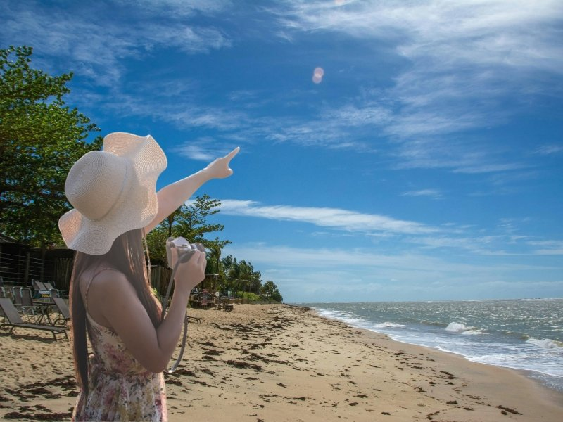

Você já se pegou olhando fotos daquelas águas cristalinas de Alagoas ou das dunas do Ceará e pensou: "Um dia eu vou, mas deve ser uma fortuna"?

Pois eu tenho uma notícia excelente para você: o **turismo no Nordeste** é um dos mais democráticos do mundo. Como aqui no **Hot Money** a nossa meta é fazer o seu dinheiro render e te mostrar caminhos para a liberdade financeira, nada mais justo do que falarmos sobre como aproveitar a vida sem precisar de um empréstimo bancário para isso.

Neste guia, vou te mostrar que o Nordeste não é apenas sol e mar; é uma lição de como o planejamento pode transformar um desejo em realidade acessível.

**Leia também:** [O Que É Cashback? Aprenda Como Ter Seu Dinheiro de Volta e Turbinar Sua Renda Extra!](https://hotmoney.blog.br/o-que-e-cashback/)

## **Por que o Nordeste é o destino número 1 para o seu bolso?**

Muitas vezes, a gente foca tanto em ganhar dinheiro que esquece de aprender a gastar com inteligência. O Nordeste brasileiro oferece uma infraestrutura que atende desde o mochileiro até o turista de luxo. A grande vantagem? A diversidade. Você consegue comer muito bem e se hospedar em lugares paradisíacos pagando uma fração do que gastaria em destinos internacionais.

### **A Intenção de Busca: O que você realmente quer saber?**

Quando as pessoas pesquisam por "Turismo no Nordeste", elas não querem apenas ver fotos; elas querem saber **quando ir** para não pegar chuva, **onde comer** sem cair em "armadilhas para turistas" e **como montar um roteiro** que faça sentido.

## **Os 3 Destinos com Melhor Custo-Benefício**

Se você quer fazer o seu dinheiro render durante as férias, esses três lugares são paradas obrigatórias:

### **1\. João Pessoa (PB): A Capital do Equilíbrio**

João Pessoa é, possivelmente, uma das capitais mais baratas do Brasil. A cidade é limpa, organizada e o custo de alimentação na orla é surpreendentemente baixo. É o lugar perfeito para quem quer pé na areia sem ver o saldo bancário sumir.

**Dica Hot Money:** Para aproveitar as piscinas naturais de Picãozinho ou o pôr do sol na Praia do Jacaré sem cair em ciladas de preços para turistas, o ideal é fechar com uma **[agência de passeio em João Pessoa](https://jampatur.com/)** que seja de confiança. Isso garante que você pague o preço justo e tenha suporte especializado, evitando gastos extras com deslocamentos mal planejados.

-   **Dica Hot Money:** Aproveite as piscinas naturais de Picãozinho. É um passeio acessível e inesquecível.

### **2\. Maragogi (AL): O Caribe Brasileiro com Preço Nacional**

Embora seja famosíssima, Maragogi oferece muitas opções de pousadas charmosas com preços justos. O segredo aqui é evitar a altíssima temporada (janeiro e feriados).

-   **Estratégia:** Fique em cidades vizinhas, como Japaratinga, onde o custo cai quase pela metade e as praias são igualmente lindas.

### **3\. São Luís e Lençóis Maranhenses (MA)**

Aqui a experiência é de outro mundo. Cruzar as dunas e mergulhar nas lagoas é um investimento em bem-estar.

-   **Análise de Mercado:** O Maranhão tem crescido muito no turismo, o que gera ótimas oportunidades de pacotes promocionais.

## **Como Economizar na Prática (O Pulo do Gato)**

Para quem acompanha o blog, sabe que o segredo do sucesso financeiro está nos detalhes. Na viagem não é diferente:

-   **Milhas Aéreas:** Se você ainda não usa cartões que pontuam, você está deixando dinheiro na mesa. Use suas milhas para a passagem e deixe o dinheiro vivo para as experiências locais.
-   **Alimentação:** Fuja dos restaurantes com "pé na areia" todos os dias. Caminhe duas quadras para dentro e descubra os restaurantes onde os moradores locais comem. A comida é mais autêntica e muito mais barata.
-   **Baixa Temporada:** Viajar em maio, junho ou agosto (fora do período de chuvas intensas em algumas regiões) pode reduzir seus custos em até 40%.

## **O Turismo como Fonte de Inspiração (e Renda Extra!)**

Já pensou que sua viagem pode virar conteúdo? Muitos leitores aqui do **hotmoney.blog.br** buscam formas de monetizar hobbies. Se você gosta de fotografar ou escrever, sua viagem ao Nordeste pode virar um guia, um ebook ou um canal no YouTube.

Transformar suas experiências em ativos é a base do que pregamos aqui. Você viaja, se diverte e ainda entende o mercado de serviços de uma das regiões que mais cresce economicamente no Brasil.

## **Conclusão: O Próximo Passo**

Viajar para o Nordeste é investir em você. Com planejamento e as estratégias certas de economia que discutimos aqui no blog, aquele "sonho caro" se torna um plano de ação totalmente possível.

E aí, qual desses destinos vai entrar no seu planejamento financeiro de 2024? Deixe seu comentário e vamos trocar dicas de como aproveitar o melhor do Brasil sem comprometer o orçamento!
