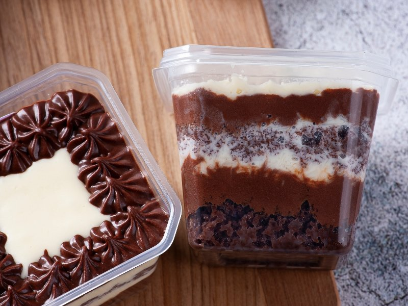
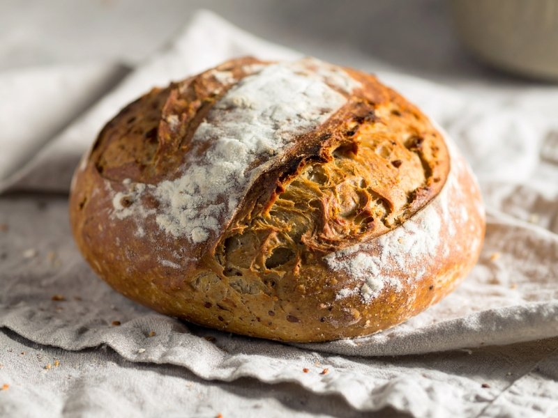

Você já pensou em transformar sua paixão por cozinhar em uma fonte de renda? Vender doces e salgados em casa pode ser a oportunidade perfeita para você! Além de proporcionar uma forma deliciosa de ganhar dinheiro, essa atividade permite que você explore sua criatividade na cozinha. Seja para complementar a renda familiar ou até mesmo iniciar um pequeno negócio, o mercado de alimentos caseiros está em alta.

Neste guia completo, vamos explorar tudo o que você precisa saber para começar a vender seus quitutes e conquistar os paladares da sua comunidade. Prepare-se para colocar as mãos na massa e deliciar seus clientes com sabores irresistíveis!

## Por que começar a Vender Voces e Salgados em Casa?

Vender doces e salgados em casa é uma excelente maneira de transformar sua paixão pela cozinha em uma fonte de renda. Com a demanda crescente por produtos artesanais, muitas pessoas estão em busca de opções saborosas e caseiras. Por que não aproveitar essa oportunidade?
Além do potencial financeiro, você tem liberdade para criar suas próprias receitas e experimentar novos sabores. Isso torna o processo divertido e recompensador! Cada cliente satisfeito traz um sorriso ao seu rosto, tornando cada venda ainda mais especial.
Outro ponto positivo é a flexibilidade. Você pode definir seus horários e trabalhar no ritmo que melhor se adapta à sua rotina. Assim, é possível conciliar essa atividade com outras responsabilidades sem estresse. É a chance perfeita para fazer algo que ama enquanto ganha dinheiro!

**Confira também:** [Como Usar a Internet para Ganhar R$ 500 extras por mês](https://hotmoney.blog.br/como-usar-a-internet-para-ganhar-extras/)

## Receitas Fáceis de Fazer e Lucrativas para Produzir em Casa

Vender doces e salgados em casa pode ser uma ótima maneira de ganhar dinheiro extra. E o melhor: existem receitas fáceis que você pode preparar sem complicação. Uma opção deliciosa é o bolo de pote, perfeito para festas e eventos. Você pode variar os sabores e criar combinações irresistíveis.
Outra receita que faz sucesso são os brigadeiros gourmet ou trufas. São simples de fazer, têm um apelo visual incrível e podem ser vendidos a preços bem atrativos. Além disso, a palha italiana é uma alternativa prática e saborosa que agrada ao público.
Nos salgados, coxinhas, risoles e bolinhas de queijo sempre caem no gosto da galera. Prepará-los em porções pequenas facilita a venda e garante frescor aos seus produtos. Aproveite essas sugestões para começar sua jornada empreendedora!

### Bolo de Pote

O bolo de pote é uma opção deliciosa e prática para quem deseja vender doces em casa. Essa iguaria conquista o paladar de todos com camadas generosas de bolo, recheio e cobertura, tudo acondicionado em potes individuais. Além disso, a apresentação é charmosa, tornando-o perfeito para festas ou eventos.
A versatilidade do bolo de pote permite criar diversas combinações de sabores. Você pode optar por clássicos como chocolate e baunilha ou ousar com opções mais sofisticadas, como red velvet ou limão siciliano. As possibilidades são infinitas!
Outro ponto positivo é que a preparação não requer habilidades avançadas na cozinha. Com receitas simples e ingredientes acessíveis, você pode produzir em grande quantidade sem complicações. Assim, os bolos ficam prontos rapidamente e prontos para serem comercializados!

### Brigadeiro Gourmet/Trufas

O brigadeiro gourmet é uma versão sofisticada do tradicional docinho brasileiro. Combinando ingredientes de alta qualidade, como chocolate belga e creme de leite fresco, ele se torna irresistível para qualquer paladar. Além disso, você pode variar os sabores com adição de frutas secas, castanhas ou até mesmo bebidas alcoólicas.
As trufas também são uma excelente opção para quem deseja inovar. Elas podem ser feitas com diferentes tipos de chocolate e ganaches saborizadas. Experimente adicionar um toque especial como licor ou café na receita e surpreenda seus clientes com combinações únicas que vão além do convencional.
Ambos os doces são fáceis de produzir em casa e têm grande aceitação no mercado. O visual caprichado também conta muito; invista em embalagens bonitas para atrair mais pessoas a experimentarem suas delícias!

### Palha Italiana

A palha italiana é uma sobremesa deliciosa e super fácil de fazer. Com apenas alguns ingredientes simples, como leite condensado, biscoitos e chocolate, você pode criar um docinho que agrada a todos. O melhor de tudo é que não precisa ir ao forno!
Essa delícia tem uma textura irresistível e combina crocância com o sabor doce do chocolate. Você pode personalizá-la adicionando diferentes tipos de coberturas ou até mesmo recheios surpresa no meio. A criatividade é seu limite.
Além disso, a palha italiana é perfeita para festas ou eventos em casa. Embaladas com carinho, elas se tornam ótimos presentes ou lembrancinhas para os convidados. Uma ótima maneira de impulsionar suas vendas!

### Salgadinhos Fritos (Coxinha, Risoles, Bolinha de Queijo)

Os salgadinhos fritos são um verdadeiro clássico nas festas e eventos. Entre os mais amados estão a coxinha, o risoles e a bolinha de queijo. Cada um deles tem seu charme e sabor único, conquistando paladares de todas as idades.
A coxinha, com sua massa crocante e recheio suculento de frango desfiado, é uma preferência nacional. Já o risoles oferece uma versatilidade incrível, podendo ser recheado com carne moída, queijo ou até legumes. E quem resiste à bolinha de queijo? O combinações irresistíveis tornam cada mordida deliciosa.
Fritar esses salgadinhos em casa pode parecer desafiador, mas o resultado vale muito a pena! Além disso, você pode experimentar diferentes temperos e recheios para deixar suas receitas ainda mais especiais e personalizadas.

### Pães Artesanais/Caseiros

Os pães artesanais e caseiros estão em alta. Fazer seu próprio pão é uma experiência gratificante e deliciosa. Além de ser simples, o aroma que invade a casa durante o preparo é irresistível.
Existem várias receitas para explorar, desde um clássico pão francês até opções mais elaboradas, como focaccia ou ciabatta. O segredo está na escolha dos ingredientes: farinha de qualidade, fermento fresco e amor no processo garantem um resultado incrível.
Você pode diversificar ainda mais ao adicionar ervas, queijos ou azeitonas à massa. Assim, seus pães não só vão encantar os clientes pelo sabor, mas também pela aparência rústica e artesanal. Essa personalização pode se tornar um diferencial nas suas vendas!

## Estratégias Eficazes Para Promover Seus Doces e Salgados

Promover seus doces e salgados pode ser um desafio, mas com as estratégias certas, você pode se destacar. Utilize as redes sociais a seu favor. Crie perfis no Instagram e Facebook para compartilhar fotos atrativas dos seus produtos e interagir com os clientes. As hashtags podem ajudar a aumentar o alcance das suas postagens.
Outra dica valiosa é investir em parcerias locais. Colabore com cafés ou eventos na sua região para oferecer degustações ou promoções conjuntas. Isso não só aumenta sua visibilidade, como também ajuda a criar uma rede de contatos que podem indicar seu trabalho.
Por fim, aproveite o boca a boca! Incentive amigos e familiares a divulgar suas delícias entre conhecidos. Oferecer descontos em compras futuras para quem recomendar novos clientes pode ser uma ótima forma de expandir sua clientela rapidamente.

## Gerenciando Pedidos e Entregas de Forma Eficiente

Gerenciar pedidos e entregas pode ser desafiador, mas com algumas estratégias simples, você garante eficiência. Comece organizando um sistema de controle. Use uma planilha ou aplicativos específicos para acompanhar os pedidos recebidos e as datas de entrega. Isso ajuda a evitar confusões.
Estabeleça horários fixos para a produção e entrega dos seus produtos. Com isso, você mantém um fluxo constante de trabalho e reduz o estresse em períodos movimentados. Além disso, informe seus clientes sobre os prazos estimados.
A comunicação é essencial! Mantenha contato com quem compra suas delícias para confirmar pedidos e avisar sobre qualquer alteração na entrega. Um cliente bem informado tende a ficar mais satisfeito com o serviço prestado.

## Dicas Para Manter a Qualidade e a Satisfação dos Clientes

Manter a qualidade dos seus doces e salgados é essencial para conquistar e fidelizar clientes. Utilize ingredientes frescos e de boa procedência, isso fará toda a diferença no sabor final. Além disso, preste atenção na apresentação dos produtos; uma embalagem bonita atrai olhares e gera interesse.
Outra dica importante é ouvir o feedback dos clientes. Pergunte sobre o que eles acharam do seu produto. Essa interação cria um laço mais forte com o consumidor, além de ajudá-lo a identificar pontos que podem ser melhorados.
Por fim, mantenha sempre um padrão nas suas receitas. Consistência é chave para garantir que os clientes voltem à sua porta em busca das mesmas delícias. Dessa forma, você estará construindo uma reputação sólida no mercado de vender doces e salgados em casa.

## Conclusão

Vender doces e salgados em casa pode ser uma ótima oportunidade para quem busca aumentar a renda ou até mesmo [iniciar um negócio](https://sebrae.com.br/sites/PortalSebrae/sebraeaz/6-passos-para-iniciar-bem-o-seu-novo-negocio,a28b5e24d0905410VgnVCM2000003c74010aRCRD). Com receitas simples, você pode criar delícias que conquistam o paladar de todos.
Lembre-se da importância de promover seus produtos nas redes sociais e manter um bom relacionamento com os clientes, sempre focando na qualidade do que oferece. Gerenciar pedidos e entregas é fundamental para garantir a satisfação dos consumidores.
A jornada empreendedora é cheia de desafios, mas com dedicação e criatividade, você poderá ver seu esforço se transformar em sucesso. Não tenha medo de experimentar novas receitas e estratégias! Cada passo dado te aproxima mais dos seus objetivos.
Agora é hora de colocar a mão na massa e começar sua aventura no mundo dos doces e salgados caseiros. Boa sorte nessa deliciosa empreitada!
